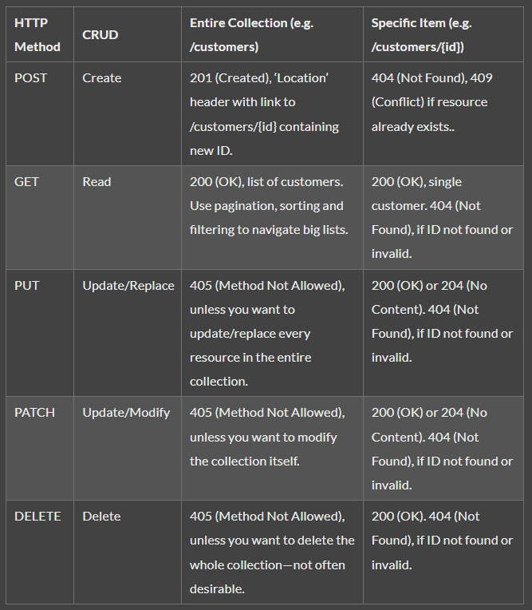

# CustomView

* 기존에 있는 View (ImageView, TextView 등) 으로 표현할 수 없는 모양의 View를 구현해야 할때 필요하다. View를 상속받는 자손 클래스를 만들어서 구현한다.
* 구현 방법
    1. API에서 제공하는 기존 View를 상속해서 해당 View를 약간 변형시킨 View
    2. 기존 API에 전혀 존재하지 않는 뷰는 최상위 클래스인 View를 상속받아 메서드를 오버라이드. 즉, onDraw(), onMeasure(), onKeyDown()과 같이 시작하는 키워드가 ‘on’인 수퍼 클래스 메서드를 오버라이드
        * onDraw():
            * 뷰를 실제로 그릴때 사용
            * Canvas 객체를 매개변수로 받음
                * Canvas 객체는 어떤 도형을 그릴지 설정
                * Paint 객체는 도형의 색, 스타일, 글꼴 등을 설정
        * protected void onMeasure(int widthMeasureSpec, int heightMeasureSpec)
            * 뷰의 크기를 설정할 때 사용
    3. 여러 뷰를 합쳐서 한번에 출력하기 위한 뷰(여러 뷰가 결합된 형태가 반복되서 사용될 때)
        * ViewGroup이나 LinearLayout 같은 Layout 클래스를 상속받아 작성

<br/>

# 컴포넌트

Android 앱은 컴포넌트로 구성되어 있는데 Activity, Service, Broadcast Receiver, Content Provider 이를 4대 컴포넌트라고 부른다. 각 컴포넌트는 하나의 독립된 형태로 존재하며, 정해진 역할을 수행한다. 참고로 컴포넌트는 앱의 구성 단위로 컴포넌트를 조합하여 하나의 앱을 만드는 것을 의미한다.

<br/>

# Activity

화면에 UI를 표시하는 기본요소. 대부분의 경우 액티비티는 꽉찬 화면을 구성하지만, 예외적으로 floating windows, multi-window mode 처럼 화면의 일부를 차지하게 할수 있다.

Acitivty 의 종류 중 하나로 FragmentActivity가 있는데, 이는 nested fragment, 즉 fragment 안에 다른 fragment가 있는 경우 고려할만 하다.

AppCompatActivity는 안드로이드 하위버전의 안드로이드를 지원하기 위해 사용된다. 참고로 AppCompatActivity는 FragmentActivity를 상속한다.

<br/>

## Activity Life Cycle


액티비티의 상태는 크게 3가지로 나눌 수 있다.

* 활성 상태(create, start, resume)
* 일시정지 (pause)
* 멈춤 (stop, destroy)

액티비티는 각각의 상태에 따른 콜백 메소드들이 존재하는데, 일반적으로 순서는

* onCreate()
    * 이 함수는 필수적으로 구현해야한다.
    * 전체 LifeCycle 동안 "한 번"만 발생한다.
    * 이 메서드에는 XML, 멤버 변수 정의, 일부 UI구성 등 설정을 한다.
    
* onStart()
    * 활성상태에 들어가면 이 함수가 호출된다. (사용자한테 보여지기 직전)
    * 호출되면 포그라운드에 보내 상호작용을 할 수 있도록 준비한다.
    * 주로 UI를 관리하는 코드를 초기화 한다. 이 메서드는 매우 빠르게 완료되고 바로 onResume을 호출한다.
    
* onResume()
    * 사용자한테 화면에 보여지고 상호작용하는 메서드이다.
    * 어떤 이벤트가 발생하여 앱에서 포커스가 떠날 때까지 이 상태에 머무른다.
    * 이 상태에서는 생명주기 구성요소가 포그라운드에서 사용자에게 보이는 동안 실행해야 하는 모든 기능을 활성화 한다. (예: 카메라 미리보기)
    * 방해가 되는 이벤트가 발생하면 일시중지 상태에 들어가고, 시스템이 onPause()를 호출한다. (예: 전화가 오거나, 사용자가 다른 화면으로 이동하거나, 기기 화면이 off될 때)
    
* onPause() 
    * 사용자가 화면을 떠날 때 시스템이 첫 번째로 이 메서드를 호출한다. (상태가 포그라운드에 있지 않게 되었다는 것을 나타냄)
    * 포그라운드에 있지 않을 때 실행할 필요가 없는 기능을 모두 정지할 수 있다. (예: 카메라 미리보기 정지)
    * 시스템 리소스, 센서 핸들(GPS), 사용자가 필요로 하지 않을 때 배터리 수명에 영향을 미칠 수 있는 모든 리소스를 해제할 수도 있다. (UI 관련 리소스와 작업을 완전히 해제하거나 조정할 때는 onPause보다 onStop을 사용하는 것이 좋다. 멀티윈도우 모드 or 화면분할 때문)
    * 이 메서드는 아주 잠깐 실행되므로 저장 작업을 하기에는 시작이 부족할 수 있다. 사용자 데이터를 저장하거나, 네트워크를 호출하거나, 데이터베이스 트랜잭션을 실행해서는 안된다. 이 메서드가 끝나기 전에 완료하지 못할 수 있다. 무거운 작업을 onStop에서 하고 데이터 저장은 viewModel, onSaveInstanceState()를 참조.
    
    > 일반적인 다이얼로그는 activity가 아니기 때문에 onPause()를 호출하지 않는다. 권한요청은 다이얼로그 처럼 보이는 ui일뿐 실제로 동작은 권한을 허용할 것인지 거절할 것인지에 대한 ui를 띄우므로 onPause()를 호출한다.
    
* onStop()
    
    * 포커스가 완전히 빠졌을 때 시스템은 이 콜백 메서드를 호출한다. (화면전체가 가려졌을 때 또는 백그라운드로 갔을 때)
    * 이 메서드에서는 앱이 사용자에게 보이지 않는 동안 앱이 필요하지 않는 리소스를 해제하거나 조정해야 한다. (예: 애니메이션 중지, 세밀한 위치 업데이트에서 대략적인 위치 업데이트로 전환할 수 있다)
    * onStop()에서 무거운 작업을 실행해야 한다고 했는데 예를들어 정보를 데이터베이스에 저장해야하는데 적절한 위치를 찾지 못했다면 이 메서드에서 저장할 수 있다. (하지만 이 함수는 항상 호출되는 것은 아니며 메모리가 부족할 경우 호출이 안될 수도 있다)
    
* onDestroy()
    * Activity가 소멸되기 전에 호출된다. 시스템은 다음 중 하나에 해당할 때 이 콜백을 호출한다.
        1. 활동이 종료되는 경우 (스택에서 날리거나 finish()를 호출)
        2. 구성 변경(예: 기기회전 또는 멀티 윈도우모드)으로 인해 시스템이 일시적으로 활동을 소멸시키는 경우
    * onStop()에서 해제하지 않은 모든 리소스를 해제해야 한다.
    * 이 메서드가 호출되는 경우 시스템이 즉시 인스턴스를 생성한 다음, 새로운 구성에서 인스턴스에 관해 onCrate()를 호출한다.  

* onRestart()
    * onStop()상태에 있던 화면이 다시 접근 했을 때 호출되는 콜백함수

<br/>

### 액티비티에서 액티비티로 이동할 때 LifeCycle 순서

1. 액티비티에서 문자가 왔을 경우(화면이 일부 가려졌을 때)

onCreate() ~ onResume() -> 문자옴 -> onPause() -> 문자사라짐 -> onResume()

2. A 액티비티에서 B 액티비티로 이동

A onCreate() ~ onResume() -> 화면이동 클릭 -> A onPuase() -> B onCreate() ~ onResume() -> A onStop() .. onDestroy() (상황에 따라)

3. 액티비티에서 백그라운드로 갔다 다시 포그라운드로 복귀 시

onCreate() ~ onReume() -> 홈버튼(백그라운드) -> onPause() -> onStop() -> 앱 복귀 -> onRestart() -> onStart() -> onResume()

<br/>

### Activity에서 configuration changes가 될 때 LifeCycle 순서


<br/>

주목할 점은 사용자가 홈버튼을 누르거나 다른 액티비티가 화면을 차지했을 때 onPause() -> onStop 상태가 되는데, 이때 액티비티의 상태는 메모리에 보관되게 되며, 기기의 RAM 메모리가 부족하게 되면 시스템의 판단에 따라 액티비티는 destroy 된다.

또, 안드로이드에서는 액티비티의 configuration이 바뀌면 (화면 회전이나 멀티 윈도우 모드로 전환 같은 경우) 액티비티가 완전히 소멸 (destroy) 된후 재시작하게 되는데, 이때 액티비티의 상태를 보존하기 위해 사용되는게 onSaveInstanceState, onRestroeInstanceState, onCreate(Bundle) 이다.

<br/>

# Fragment

프래그먼트는 액티비티의 부분을 동적으로 동작시키기 위해 생긴 개념이다. 쉽게 비유를 들어 설명하자면, 앱하나를 서랍이라고 하고 액티비티를 서랍의 한칸이라고 하면, 프래그먼트는 서랍안의 부분부분을 나눠서 정리하는 정리함의 한 칸이라고 생각하면 된다.

프래그먼트를 사용하는 대표적인 예로 탭레이아웃이 있는데, 탭을 눌러서 다른화면으로 전환하는 앱의 경우이다. 이때 한 액티비티안에서 탭을 눌렀을 때 보여지는 프래그먼트만 바꾸게 되는데, 프래그먼트는 액티비티와 달리 스택에 쌓이지 않기 때문에 백버튼을 누른다고 해서 이전 프래그먼트로 돌아가지 않는다. 만약 어떤 이유로 프래그먼트를 스택에 넣고 싶다면 개발자가 직접 backStack에 추가해주는 방법도 있다.

<br/>

## Fragment 생명주기


* onAttach(Activity)   
    * 액티비티에서 프래그먼트가 호출될 때 최초 한번 호출되는 함수
* onCreate(Bundle)   
    * 프래그먼트가 생성될 떄 호출되는 함수   
* onCreateView(LayoutInflater, ViewGroup, Bundle)
    * 프래그먼트의 뷰를 생성하는 함수   
* onActivityCreated(Bundle)
    * 액티비티에서 onCreate()가 호출 된 프래그먼트에서 호출되는 함수 
* onStart()   
    * 프래그먼트가 사용자한테 보여지기 직전 호출되는 함수 
* onResume()
    * 프래그먼트가 사용자와 상호작용할 수 있는 상태  
* onPasue()   
    * 화면이 일부 가려졌을 때 호출
* onStop()  
    * 프래그먼트가 화면에 사라졌을 때 호출  
* onDestroyView() 
    * 프래그먼트의 View가 사라질때 호출되는 함수 
* onDestroy()
    * 프래그먼트가 제거될 때 호출되는 함수
* onDetach()  
    * 프래그먼트가 액티비티와 연결이 종료될 때 호출되는 함수

액티비티와 생명주기가 거의 비슷한데, onAttach, onCreateView, onDestroyView, onDetach라는 콜백이 추가된다. onCreateView에서 프래그먼트에 맞는 UI Layout을 리턴한다.

<br/>

## Fragment Manager

* 프래그먼트를 추가, 삭제 또는 교체하고 백스택에 추가하는 등의 작업을 실행하는 클래스
* 프래그먼트의 변경사항 집합을 트랜잭션이라고 한다.

## Fragment Transaction

* 각 트랜잭션은 수행하고자 하는 변경사항의 집합이다. 변성사항을 설정하려면 add(), remove(), replace()와 같은 메서드를 사용해야 한다.

<br/>

# Activity와 Fragment의 차이점

1. 액티비티는 독립적으로 활용할 수 있다.
2. 프래그먼트는 액티비티에 종속되어 있다.
3. 액티비티는 전체화면을 차지하지만 프래그먼트는 전체 화면이 아니여도 되며 디자인에 많은 유연성을 가지고 있다.
4. 액티비티는 자동적으로 백스택에 넣어지고 프래그먼트는 트랜잭션을 통해서 요청해야 한다.

<br/>

# BroadcastReceiver

안드로이드의 컴포넌트 중 하나로 원하는 메시지를 보내거나 받을 수 있는 컴포넌트이다. 예를 들면, 충전기를 꼽았다던지, SMS문자메시지, 전화가 온다거나 하는 일에 대한 메세지를 받을 수 있다. sendBroadCast() 라는 메소드를 통해 메세지를 보내면 리시버에서 메세지를 받을 수 있다.

BroadCastReceiver를 등록하는 방법은 크게 두가지가 있다. 첫번째로 정적으로 등록하는 방법인데, AndroidManifest 파일에 리시버라는 태그를 이용해서 추가하는 방법이다. 이 방법을 사용하면 앱이 실행중이지 않을때도 메세지를 받을 수 있다.

두번째 방법으로 동적 등록은 액티비티의 Context를 통해 등록한다. Context의 registerReceiver() 메소드를 통해 등록할 수 있는데, 이렇게 등록하게 되면 액티비티가 destroy되기 전까지만 메세지를 받을 수 있다. unRegisterReceiver()를 통해 리시버가 더 이상 필요하지 않을때 해제시킬 수 있다.

#### 메시지를 보내는 방법

sendOrderBroadcast() 는 한번에 한 수신자에게만 메세지를 전달한다. BroadcastReceiver를 따라 전파됨에 따라 다음 수신자에게 계속 메세지를 전달할수도, 또는 차단할수도 있다.
sendBroadcast()는 모든 수신자에게 메세지를 전파한다.
LocalBroadcastManager.sendBroadcast() 의 경우 송신자 내부 프로세스에서만 메세지를 전달한다. 해당 Broadcast message 를 앱 내부에서만 사용한다면 해당 메서드를 사용하는 것이 효율적이다. 프로세스간 통신이 불필요하며 속도 및 보안적으로도 훨씬 더 유리한 방법이다.

* 매개변수로 action이 추가된 Intent를 보내줘야함. 

```
예) intent.setAction("com.example.test");
sendBroadcast(intent);
```

소스: [https://medium.com/@eevee300/android-broadcast-receiver-%EC%95%8C%EC%95%84%EB%B3%B4%EA%B8%B0-84d3ce07db88](https://medium.com/@eevee300/android-broadcast-receiver-%EC%95%8C%EC%95%84%EB%B3%B4%EA%B8%B0-84d3ce07db88)

#### 메시지 받는 방법

onRecieveMessage(Context, Intent) 를 사용한다. 메니페스트에 등록한 경우에는 BroadCastReceiver를 상속하는 클래스를 만들고, 액티비티 컨텍스트를 통해 등록한 경우에는 액티비티 내부에서 브로드캐스트리시버의 익명 클래스를 만들면 된다.

참고로 BroadcastReceiver은 추상클래스로 그 중 추상 메소드는 onReceive() 메소드 하나이다.

<br/>

# Content Provider

앱간의 데이터 교환을 위해 다른 앱에게 데이터를 제공하고 데이터를 가져올 수 있게 하는 컴포넌트이다. 즉, 앱 간의 데이터 공유를 목적으로 사용되는 컴포넌트이다. 실제로 앱의 데이터베이스는 해당 앱만 접근 가능하기 때문에 다른 앱의 데이터를 가져오기 위해서는 ContentProvider를 사용해야 한다.

추가: CalenderProvider ContactsProvider

<br/>

# Service

백그라운드에서 오래 실행되는 작업을 할때 사용되는 구성요소이다. 다른 애플리케이션 구성요소가 서비스를 실행할 수 있고, 서비스는 다른 애플리케이션으로 전환되더라도 계속 실행된다.

서비스는 포그라운드, 백그라운드, 바인드 서비스가 있다.

* 포그라운드 서비스는 사용자에게 보이는 서비스를 제공하고 알림을 표시해야 한다. 음악 플레이어 앱을 사용해 노래를 트는 경우를 생각하면 된다.
* 백그라운드 서비스는 사용자에게 보이지 않는 작업을 수행한다. 예를 들어 앱이 저장소를 압축하는데 서비스를 사용하였다면, 이는 대개 백그라운드 서비스이다.
* 바인드 서비스는 다른 앱 구성요소가 bindService() 메소드를 호출하여 구성요소가 서비스에 바인딩되는 경우이다. 바인딩된 서비스는 해당 구성요소와 서로 상호작용할 수 있고, 하나의 서비스가 여러개의 구성요소와 바인딩되는 경우도 가능하다. 이때 모든 바인딩된 구성요소에서 바인딩이 해제되면 서비스는 소멸한다.

<br/>

## 서비스와 쓰레드

서비스는 쓰레드가 아니라 단순히 백그라운드에서 실행 될수 있는 구성요소이고 기본적으로 메인쓰레드에서 실행된다. 만약 서비스가 집약적이거나 메인쓰레드와 별도로 작업을 수행해야 한다면, 서비스 안에서 새로운 쓰레드를 만들어서 작업해야 한다.

<br/>

## 안드로이드 8 이후의 서비스와 브로드캐스트 리시버

안드로이드 8 이후 사용자와의 상호작용과 별개로 백그라운드에서 수행되는 메니페스트로 등록된 브로드캐스트리시버와 서비스에 대한 제한이 강화 되었다.

브로드캐스트 리시버의 경우 예전에는 시스템으로 부터 충전기가 연결되었다던지 하는 메세지를 받게 되면 저장소 정리를 한다던지 하는 식으로 많이 이용됬었는데, 이런 식으로 백그라운드에 등록되는 앱이 많아지게 되면 시스템에 과부하가 걸릴 수 있어서, 안드로이드 8 이후로 암시적 브로드캐스트에 대한 리시버의 등록을 제한시켰다. 암시적 브로드캐스트란 특정 앱을 대상으로 하지 않는 브로드캐스트이다.

백그라운드 서비스는 우선순위가 높은 메세지만 받을수 있게 되며, sms/mms와 같은 메세지는 받을 수 있다. 또한, 알림에서 PendingIntent를 수행하는 일 또한 가능하다.

구글에서는 이러한 제한 사항으로 못하게 된 작업들을 JobScheduler(WorkManager)를 통해 수행하길 권장한다.

<br/>

# Intent

인텐트는 컴포넌트를 실행하기 위해 시스템에 넘기는 정보로, 해당 객체를 통해 컴포넌트 간에 데이터를 전달할 수도 있다.

## Intent Types

### Explicit Intent(명시적 인텐트)

명시적 인텐트는 인텐트에 클래스 객체나 컴포넌트 이름을 지정하여 호출할 대상을 확실히 알 수 있는 경우에 사용한다(주로 애플리케이션 내부에서 사용)

<br/>

### Implicit Intent(암시적 인텐트)

인텐트의 액션과 데이터를 지정하긴 했지만, 호출할 대상이 달라질 수 있는 경우에는 암시적 인텐트를 사용합니다. 즉 설치된 애플리케이션에 대한 정보를 알고 있는 안드로이드 시스템이 인텐트를 이용해 요청한 정보를 처리할 수 있는 적절한 컴포넌트를 찾아본 다음 사용자에게 그 대상과 처리 결과를 보여주는 과정을 거치게 된다.


<br/>

## Intent Filter

암시적 인텐트를 통해 사용자로 하여금 어느 앱을 선택할지 선택하도록 할 때 IntentFilter가 필요하다.

<br/>

## PendinIntent

펜딩 인텐트는 이름에서 볼수 있듯이 보류된 인텐트로, 당장 해당 작업을 다른 컴포넌트에 요청하는게 아닌 특정시점에 자신이 아닌 컴포넌트가 다른 컴포넌트에게 펜딩 인텐트를 사용하여 작업을 요청한다는 특징이 있다.

대표적으로, 사용자가 Notification을 클릭했을 때 특정한 작업을 수행시키거나, 위젯을 통해 앱을 실행시키거나, 미래의 특정 시점에 실행되는 인텐트를 선언하는 경우에 펜딩 인텐트를 사용한다.

펜딩인텐트의 인스턴스를 생성하는 방법은 크게 네가지가 있다.

* getActivity(Context, int, Intent, int): 매개변수에 포함된 Intent를 통해 한가지 액티비티를 실행시킬때 사용
* getActivities(Context, int, Intent[], int): 매개변수에 포함된 Intent배열을 통해 여러개의 액티비티를 실행시킬때 사용. 이때 Context.* * startActivities와 똑같이 작동한다. startActivities는 거의 사용되지 않지만 액티비티들을 백스택에 넣고 싶을때 사용되기 때문에 실행된 액티비티에서 백버튼을 눌렀을때 다른 액티비티로 이동하고 싶다면 사용한다.
* getBroadcast(Context, int, Intent, int): context.sendBroadCast(intent)를 하고 싶을때 사용
* getService(Context, int, Intent, int): Intent를 통해 context.startService(intent)를 하고 싶을때 사용

<br/>

# ANR(Application Not Responding)

Android 앱의 UI 스레드가 너무 오랫동안 차단되면 'ANR(애플리케이션 응답없음)' 오류가 나타나게 된다. 앱이 포그라운드에 있으면 아래와 같이 시스템에서 사용자에게 다이얼로그를 표시한다.


안드로이드 프레임워크에서 ANR 관련된 내용은 com.android.server.am.ActivityManagerService에서 확인 할 수 있다(ActivityManagerService는 system_server 프로세스에서 실행된다).

<br/>

## ANR이 발생하는 경우

* 화면 터치와 키 입력에서 ANR

메인 스레드를 어디선가 이미 점유하고 있다면 키 이벤트를 전달하지 못하는데, 이벤트를 전달할 수 없는 시간이 타임아웃을 넘는다면 이때 ANR이 발생한다. **키 이벤트인 볼륨, 메뉴, 백 키의 경우는 눌리고서 5초 이상 지연 시 바로 ANR을 발생** 시킨다. 참고로 홈 키와 전원 키는 앱과 별개로 동작하고 ANR 발생과는 무관하다.

터치 이벤트는 경우가 다르다. 터치 이벤트도 메인 스레드가 사용 중이라면 대기하는 것은 동일하지만 타임아웃 된다고 해서 바로 ANR이 발생하지 않는다. 그 다음으로 이어서 터치 이벤트가 왔을 때는 **두 번째 터치 이벤트가 전달되지 않는 시간이 타임아되면 ANR이 발생** 한다. 예를 들어, 어디선가 메인 스레드를 블로킹하고 있는데 이때 첫 번째 터치 이벤트만으로는 ANR이 발생하지 않는다. 두 번째 터치 이벤트가 있고서 5초가 지나면 그때서야 ANR이 발생한다.

* Message 처리 각각이 5초 이내라도 총합 처리 시간 영향

가끔 혼동하는 경우가 있는데 특정 Message 처리가 5초가 넘더라도 그 사이에 터치가 없을 때는 문제가 발생하지 않는다. 예를들어, for문을 0부터 4까지 돌리는데 2초씩 메인 스레드를 블로킹하고 있다고 가정하자. 5개의 Message를 처리하는 시간은 총 10초다. 가만히 두면 문제가 없다. 하지만 Message를 처리하는 중에 화면을 두 번 이상 터치하면 ANR이 발생한다. (앞에 쌓여있는 Message를 먼저 처리하느라 터치 이벤트에 대한 처리가 지연되는 것)

* 서비스나 브로드캐스트 리시버에서도 5초 이내로 Message 처리 필요

예를 들어 50초 동안 BroadcastReceiver의 onReceive()가 실행되고 있을 때 액티비티 화면을 터치하면 역시 ANR 발생 가능성이 높다. 브로드캐스트 리시버나 서비스도 액티비티가 떠있는 상태를 고려해서, 타임아웃을 5초라고 생각하는 편이 낫다. 결론적으로 브로드캐스트 리시버의 경우에 오래 걸리는 작업이 있다면 서비스로 넘겨서 실행해야 하고, 서비스에서는 다시 백그라운드 스레드를 이용해야 한다.

<br/>

# MainThread + Handler

애플리케이션은 성능을 위해 멀티 스레드를 많이 활용하지만, UI를 업데이트하는 데는 단일 스레드 모델이 적용된다. 멀티 스레드로 UI를 업데이트하면 동일한 UI 자원을 사용할 때 교착 상태(deadlock), 경쟁 상태(race condition) 등 여러 문제가 발생할 수 있다. 따라서 UI 업데이트를 메인 스레드에서만 허용한다.

앱 프로세스가 시작되면서 메인 스레드가 생성된다. 컴포넌트의 생명주기 메서드와 그 안의 메서드 호출은 기본적으로 메인 스레드에서 실행된다. 메인 스레드는 UI를 변경할 수 있는 유일한 스레드이기 때문에 메인 스레드를 UI 스레드로 부르기도 한다. 서비스, 브로드캐스트 리시버, Application은 사용자 인터페이스가 아니기 때문에, UI 스레드에서 실행된다고 하면 개념을 혼동하기 쉽다. UI를 변경하는 유일한 수단이라는 의미를 강조하기 위해서 UI 스레드를 쓴다고 이해하면 편할 것 같다.

<br/>

## [안드로이드 애플리케이션에서 메인 스레드](https://medium.com/write-android/%EB%A9%94%EC%9D%B8-%EC%8A%A4%EB%A0%88%EB%93%9C%EC%99%80-handler-part-1-handler%EC%99%80-looper-%EA%B7%B8%EB%A6%AC%EA%B3%A0-messagequeue%EC%9D%98-%EB%8F%99%EC%9E%91-%EB%B0%A9%EC%8B%9D-f0bee443d71e)

안드로이드 프레임워크 내부 클래스인 android.app.ActivityThread가 애플리케이션의 메인 클래스이고, ActivityThread의 main() 메서드가 애플리케이션의 시작 지점이자 메인 스레드가 되는 곳이다. ActivityThread는 어떤 것도 상속하지 않은 클래스다. 액티비티만 관련되어 있는 것도 아니고 모든 컴포넌트들이 다 관련되어 있다. AppCompatActivity → FragmentActivity → ComponentActivity → androidx.core.app.ComponentActivity → Activity → ActivityThread 로 들어가면 볼 수 있다.

``` java
ActivityThread.java

public static void main(String[] args) {
    /* ..*/
    Looper.prepareMainLooper();  // 1번
		/* .. */
    ActivityThread thread = new ActivityThread();
    thread.attach(false, startSeq);
  
    if (sMainThreadHandler == null) {
        sMainThreadHandler = thread.getHandler();
    }
		/* .. */   
		Looper.loop(); // 2번

    throw new RuntimeException("Main thread loop unexpectedly exited");
}
```

1번 -> 메인 Looper를 준비한다.

2번 -> UI Message를 처리한다. Looper.loop() 메서드에서 무한 반복문이 있기 때문에 main 메서드는 프로세스가 종료될 때까지 끝나지 않는다.

<br/>

## Looper 클래스


Looper는 이름에서도 알 수 있듯이 하나의 반복 작업을 맡고 있는 역할로 이해할 수 있다. 실제로 프로세스가 종료될 때까지, 무한 반복문을 통해 반복 작업을 수행하게 된다. 여기서 Looper가 맡은 반복작업은 구체적으로 MessageQueue에 있는 message, runnable을 계속해서 하나씩 꺼내주는 작업이 되겠다.

<br/>

* 스레드별로 Looper 생성

Looper는 TLS(thread local storage)에 저장되고 꺼내어진다. ThreadLocal<Looper>에 set() 메서드로 새로운 Looper를 추가하고, get() 메서드로 Looper를 가져올 때 스레드별로 다른 Looper가 반환된다. 그리고 Looper.prepare()에서 **스레드별로 Looper를 생성** 한다. 특히 메인 스레드의 메인 Looper는 ActivityThread의 main() 메서드에서 Looper.prepareMainLooper()를 호출하여 생성한다. Looper.getMainLooper()를 사용하면 어디서든 메인 Looper를 가져올 수 있다.

* Looper별로 MessageQueue를 가짐

**Looper는 각각의 MessageQueue를 가진다.** 특히 메인 스레드에서는 이 MessageQueue를 통해서 UI 작업에서 경쟁 상태를 해결한다.

<br/>

## Message와 MessageQueue

Message란 실제 수행해야할 작업에 대한 명세가 들어있는 자료구조이며, MessageQueue는 Message를 담는 자료구조이다. 이를 Looper와 관련지어 본다면, MessageQueue는 Looper의 반복 대상이며, Message는 Looper의 실질적인 반복의 결과물로 이해할 수 있다. Message를 생성할 때는 사용한 message 객체를 다시 초기화하여 재사용하는 방식인 오브젝트 풀 방식을 사용한다.

<br/>

## Handler 클래스

### Handler 역할 두가지

Handler가 가진 역할을 크게 아래 두가지로 요약할 수 있다.

* Message를 MessageQueue에 보내는 역할
* MessageQueue에서 꺼낸 Message를 처리하는 역할(MessageQueue에서 Message를 꺼내는 역할은 Looper의 역할)

``` java
Handler()
Handler(Handler.Callback callback)
Handler(Looper looper)
Handler(Looper looper, Handler.Callback callback)
```

Handler가 작업을 처리하기 이전에, Handler는 (MessageQueue에서 Message를 꺼내줄) Looper와 연결되어 있어야 한다. 따라서 Handler의 생성 또한 Looper와 연결지어 이해해야한다. Looper를 생성하는 방법은 위와 같이 총 4가지가 있는데, 첫 번째와 두 번째 생성자를 통해 생성하는 방법은 deprecated 됐다. 암시적으로 Looper를 선택했을 때, 아래와 같은 문제가 발생할 수 있기 때문이다.

* Handler가 새 작업을 기대하지 않고 종료하는 경우의 작업이 자동으로 손실되는 bugs
* Looper가 활성화되지 않은 스레드에서 Handler가 생성되는 경우의 crashes
* Handler가 연결된 스레드가 개발자가 예상한 것과 다를 때의 경쟁 상태(Race conditions)

<br/>

### Handler 동작

위에서 언급했듯이 Handler는 Message를 MessageQueue에 보내는 것과 Message를 처리하는 기능을 함께 제공한다. Message Queue에 Message를 보낼 때, **Message의 형태** 와 **Message의 처리 시점** 에 따라 다양한 메서드를 사용한다.

#### Message의 형태

* send로 시작하는 메서드는 Message를 보낸다.
* post로 시작하는 메서드는 Runnable 형태의 Message를 다룬다.

#### Message의 처리 시점에 따른 함수

* ~Delayed()
* ~AtTime()
* ~AtFrontOfQueue()

<br/>

### Handler 용도

Handler는 일반적으로 UI 갱신을 위해 사용된다.

* 백그라운드 스레드에서 UI 업데이트: 백그라운드 스레드에서 네트워크나 DB 작업 등을 하는 도중에 UI를 업데이트 한다. AsyncTask에서도 내부적으로 Handler를 이용해서 onPostExecute() 메서드를 실행해서 UI를 업데이트한다.

* 메인 스레드에서 다음 작업 예약: UI 작업 중에 다음 UI 갱신 작업을 MessageQueue에 넣어 예약한다. 작업 예약이 필요한 경우가 있는데, 예를 들어 onCreate() 메서드에서(소프트 키보드를 띄우는 것이나, ListView의 setSelection()) 작업을 할 경우 잘 동작하지 않는다. 이때 Handler에 Message를 보내면 현재 작업이 끝난 이후의 다음 타이밍에 Message를 처리한다.

<br/>

### Handler의 타이밍 이슈

원하는 동작 시점과 실제 동작 시점에서 차이가 생기는데, 이런 타이밍 이슈는 메인 스레드와 Handler를 이해하고 나면 해결할 수 있다. Activity의 onCreate() 메서드에서 Handler의 post() 메서드를 실행하면 어느 시점에 실행될까? 실제 post() 메서드에 전달되는 Runnable이 실행되는 시점은 언제일까? 메인 스레드에서는 한 번에 하나의 작업밖에 못하고, 여러 작업이 서로 엉키지 않기 위해서 메인 Looper의 MessageQueue에서 Message를 하나씩 꺼내서 처리한다는 것을 염두에 두자. 

MessageQueue에서 Message를 하나 꺼내오면 onCreate() ~ onResume()까지 쭉 실행이 된다. 그럼 답은 나왔다. **onCreate()에서 Handler의 post()에 전달한 Runnable은 onResume() 이후에 실행**된다.

<br/>

### 지연 Message는 처리 시점을 보장할 수 없다.

Handler에서 전달된 지연 Message는 지연 시간을 정확하게 보장하지 않는다. MessageQueue에서 먼저 꺼낸 Message 처리가 오래 걸린다면 실행은 당연히 늦어진다.

예를들어 0.2초 후에 로그를 남기는 Handler가 있고 0.5초를 멈추는 Handler가 있다고 가정하면 로그를 남기는 Handler는 0.2초 후가 아닌 0.5초가 지난 후에 로그를 남긴다.

<br/>

# Dialog and Toast, SnackBar

## [Dialog](https://developer.android.com/guide/topics/ui/dialogs)

다이얼로그는 사용자에게 추가 정보를 입력 또는 결정을 내릴 때 표시하는 작은 화면을 뜻한다.


<br/>

## [Toast](https://developer.android.com/guide/topics/ui/notifiers/toasts)

토스트 메세지는 작은 팝업으로 메세지에 필요한 공간만 차지하고 진행 중인 작업을 그대로 표시되고 사용자와 상호작용도 유지된다. 토스트 메세지는 시간이 초과하면 자동으로 사라진다.


<br/>

## [SnackBar](https://developer.android.com/training/snackbar/action)

SnackBar는 토스트와 비슷하지만 사용자가 메시지에 응답할 수 있다.


<br/>

# Annotation

특정 클래스, 변수, 메소드 등에 붙이는 코드로 해당 타겟의 기능을 좀 더 명확하게 해주는 역할을 수행한다.

* [Kotlin Annotation](https://codechacha.com/ko/kotlin-annotations/)
* [Android Annotation](https://velog.io/@changhee09/%EC%95%88%EB%93%9C%EB%A1%9C%EC%9D%B4%EB%93%9C-%EC%96%B4%EB%85%B8%ED%85%8C%EC%9D%B4%EC%85%98-%EC%82%AC%EC%9A%A9)
* [Android와 Annotation](https://tosslab.github.io/android/2015/03/01/02.android-%EC%99%80-annotation.html)

<br/>

# Context

## [Context](https://arabiannight.tistory.com/284)

Context가 없으면 액티비티를 시작할 수도, 브로드캐스트를 발생시킬 수도, 서비스를 시작할 수도 없다. 리소스에 접근할 때도 Context를 통해서만 가능하다. Context는 여러 컴포넌트의 상위 클래스이기 때문이다.
즉, 안드로이드 시스템이 어플리케이션이나 컴포넌트 등을 관리하기 위해 만든 것이다.

Context는 추상 클래스인데 메서드 구현이 거의 없고 상수 정의와 추상 메서드로 이루어진다. Context를 직접 상속한 것은 ContextWrapper이고 ContextWrapper를 상속한 것은 Activity, Service, Application이다(BroadCastReceiver와 ContentProvider는 Context를 상속한 것이 아니다).

<br/>

## ContextWrapper 클래스

ContextWrapper 클래스는 Context를 래핑한 ContextWrapper(Context base) 생성자를 갖고 있다.

``` java
public ContextWrapper(Context base) { // 1
    mBase = base;
}

protected void attachBaseContext(Context base) { // 2
    if (mBase != null) {
        throw new IllegalStateException("Base context already set");
    }
    mBase = base;
}

public Context getBaseContext() {
    return mBase;
}

@Override
public Context getApplicationContext() {
    return mBase.getApplicationContext();
}

@Override
public void startActivity(Intent intent) {
    mBase.startActivity(intent);
}

@Override
public void sendBroadcast(Intent intent) {
    mBase.sendBroadcast(intent);
}

@Override
public Resources getResources() {
    return mBase.getResources();
}
```

1, 2 에서 base 파라미터에 전달되는 것은 Context의 여러 메서드를 직접 구현한 ContextImpl 인스턴스이다. ContextWrapper의 여러 메서드는 base의 메서드를 그대로 다시 호출한다. Activity, Service, Application은 1의 생성자를 사용하지 않고, 실제로는 2의 attachBaseContext() 메서드를 사용한다. Activity, Service, Application 모두 내부적으로 ActivityThread에서 컴포넌트가 시작된다. 이때 각 컴포넌트의 attach() 메서드를 실행하고 attach() 메서드에서 또다시 attachBaseContext() 메서드를 호출한다.

ContextWrapper에 getBaseContext()와 getApplicationContext() 라는 2개의 메서드가 별도인 것을 보면 싱글톤이 아닌 것을 알 수 있다. Activity, Service, Application 컴포넌트는 각각 생성한 ContextImpl을 하나씩 래핑하고 있고 getBaseContext()는 각각 ContextImpl 인스턴스를 리턴한다. getApplicationContext()는 Application 인스턴스를 리턴하는 것으로 Application은 앱에서 1개밖에 없고 어디서나 동일한 인스턴스를 반환한다.

<br/>

## ContextImpl의 메서드

* 앱 패키지 정보를 제공하거나 내/외부 파일, SharedPreferences, 데이터베이스 등을 사용하기 위한 헬퍼 메서드
* Activity, BroadcastReceiver, Service와 같은 컴포넌트를 시작하는 메서드와 퍼미션 체크 메서드
* ActivityManagerService를 포함한 시스템 서비스에 접근하기 위해서 사용되는 getSystemService() 메서드

<br/>

## Context와 하위 클래스


Activity, Service, Application을 보면 ContextImpl을 직접 상속하지 않고, ContextImpl의 메서드를 호출하는 형태라는 것을 알 수 있다. 이렇게 하면 ContextImpl의 변수가 노출 되지 않고, ContextWrapper에서는 ContextImpl의 공개 메서드만 호출하게 된다. 또한 각 컴포넌트별로 사용하는 기능을 제어하기도 단순해 진다.

<br/>

## 사용 가능한 Context

Activity로 예를 들어보면 Context 인스턴스는 3개가 있다.

* Activity 인스턴스 자신(this)
* getBaseContext()를 통해 가져오는 ContextImpl 인스턴스
* getApplicationContext()를 통해 가져오는 Application 인스턴스 : Activity의 getApplication() 메서드로 가져오는 인스터스와 같다.

위 3개의 인스턴스가 다르기 떄문에 캐스팅을 함부로 하면 안된다. 이를테면 getBaseContext()로 가져오는 것을 Activity로 캐스팅하면 ClassCastException이 발생한다. View의 클래스를 보면 생성자에 Context가 들어가는데 이 Context가 어디서 온 것인지 확인해 볼 수 있다.

``` kotlin
val context1 = (view.context == this) // 1
val context2 = (view.context == baseContext) // 2
val context3 = (view.context == applicationContext) // 3
val context4 = (view.context == application) // 4

println(context1)
println(context2)
println(context3)
println(context4)

>> true
>> false
>> false
>> false
```

1에서만 true가 나오는 것을 볼 수 있다. View 클래스는 생성자에 Context가 전달되어야 하는데 Activity에 쓸 수 있는 3가지 Context 모두 다 전달 가능하다. 그러나 View와 연관이 깊은 것은 Activity이므로 Activity가 전달된 것을 이해할 수 있을 것이다.

<br/>

## 요약

리눅스 환경에서 어플리케이션을 프로세스 단위로 관리한다. Context는 프로세스 내에서 컴포넌트를 관리를 해야하고 이를 관리하기 위해 만든 추상클래스이다. 즉, 리눅스에서 프로세스를 ID를 붙여 관리하듯 안드로이드 시스템은 어플리케이션 또는 컴포넌트 등을 Context로 관리한다.

<br/>

# [LayoutInflater](https://medium.com/vingle-tech-blog/android-layoutinflater-b6e44c265408)

LayoutInfalter는 **XML에 미리 정의해둔 툴을 실제 메모리에 올려주는 역할** 을 한다. Infalter 단어의 뜻이 부불리다라는 의미로써 LayoutInfalter라는 단어에서도 유추가 가능하다. 즉, LayoutInflater는 **XML에 정의된 Resource를 View 객체로 반환** 해주는 역할을 한다. 우리가 매번 사용하는 onCreate() 메서드에 있는 setContentView(R.layout.activity_main) 또한 Inlfater 역할을 한다(이 함수 내부에서 LayoutInflater가 실행되어 view들을 객체화한다).


**참고**
* [LayoutInflater](https://www.crocus.co.kr/1584)

<br/>

# AsyncTask Deprecated

AsyncTask는 백그라운드에서 작업을 수행한 뒤 그 결과를 UI Thread에서 갱신할때 주로 사용된다. 최대 몇초간의 짧은 작업에 사용하는게 가장 적절하다. AsynkTask는 순차적으로 실행되는데, 만약 병렬적으로 실행하고 싶다면 `myTask.executeOnExecutor(AsyncTask.THREAD_POOL_EXECUTOR);` 처럼 사용할 수 있다.
장점으로는 비동기적 처리를 하기 쉽고, 핸들러보다 코드적으로 깔끔하다는 장점이 있다. 단점은 재사용이 불가하고, 종료를 하지 않으면 종료가 되지 않는다는 단점이 있다.

## 왜 deprecated?

1. 메모리 누수
    * 액티비티 종료시점과 어싱크가 끝나는 시점이 다르다. 액티비티가 종료될 때 어싱크가 오래 걸리는 게 아니라면 일시적인 현상이므로 큰 문제는 아님. 문제가 되는 것은 화면 회전 등으로 인해 계속해서 어싱크가 쌓여서 실행하는 경우. 이 경우는 화면이 회전할 때 액티비티는 종료되고 새로 시작된다. 새로 생성된 액티비티는 다른 인스턴스인데, 어싱크가 아직 실행 중인 경우에는 기존 액티비티도 메모리에서 제거가 되지 않는다(oom = out of memory 원인 가능성)
2. 순차 실행으로 인한 속도저하
3. 프래그먼트에서 어싱크 실행문제
    * 프래그먼트에서 어싱크를 실행하고 백키로 액티비티를 종료하면 프래그먼트는 액티비티와 분리되면서 getContext, getActivity가 null을 리턴. 따라서 onPostExecte에서 널포인트 발생
4. 예외처리 메서드 없음
    * 취소(cancel)만 있고 onError가 없다.
5. 병렬 실행 시 doinBackground 실행 순서가 보장되지 않음
    * 안드로이드 버전이 올라가면서 기본 동작이 병렬 실행에서 순차 실행으로 바뀜

이런 이유로 Api R (Android 11)부터는 deprecated 된다. 구글에서는 대안으로 java.util.concurrent API나 Kotlin coroutine을 사용하길 권장하고 있으며 RXJava 또한 합리적인 대안이라고 한다.

<br/>

# Manifest file

애플리케이션에 관한 정보를 입력하는 파일로 xml 형태로 저장된다. <Manifest>, <Application>, <Activity> 등의 태그를 포함할 수 있고, 패키지 이름, 앱 이름, 앱 설명, 아이콘, 앱이나 구성요소에 필요한 권한, 앱에서 사용되는 액티비티, 서비스, 브로드캐스르에 대한 정보 등 전반적인 앱에 대한 정보를 저장한다.

<br/>

# Image (Picasso / Glide)

안드로이드에서 ImageView에 사진을 띄우고자 하는 경우는 다음과 같다.

1. 안드로이드 앱 안의 drawable폴더의 리소스를 보여주는 경우
2. 안드로이드 디바이스 안에 저장되어있는 사진을 보여주는 경우(갤러리 혹은 기타 내부 사진)
3. 이미지 URL을 로드해서 보여주고자 하는 경우

1,2번의 경우는 안드로이드 기기 내부의 리소스를 불러오는 작업이므로 예외사항도 적고 실제 구현도 복잡하지 않다. 그러나 3번처럼 이미지의 URL인 경우 http 클라이언트를 이용해서 ImageView에 보여주어야 하는 경우는 고려해야할 사항이 많다. 예를 들면 로딩 실패처리, 재시도처리, Out of Memory, 캐시, 병렬처리, 디코딩, 이미지재활용 등등이 있다.

> 요약하면, 이미지 로딩을 구현할 때는 HTTP 통신을 안정되게 구현하고, 비트맵으로 디코딩하면서 메모리가 넘치거나 새지 않도록 주의해야 한다. 네트워크 호출과 디코딩은 단순히 백그라운드 스레드에서 동작하는 것만으로는 충분하지 않고 더 적극적으로 병렬성을 활용해야 한다. 화면 회전, 전환, 스크롤 때 반복적인 요청이 가지 않도록 이미지를 캐시하고, 불필요해진 요청은 빠른 시점에 취소해서 더 나은 UI 반응을 제공하면서 자원을 절약해야 한다. 이 과제들을 모두 해결하려다 보면 처리 흐름은 복잡해지고, 비슷한 코드가 반복되기 쉽다.

따라서 안드로이드에서는 이러한 문제들을 미리 다 해결해둔 이미지로딩 라이브러리를 많이 사용하는데, 이미지 로딩 라이브러리중 대표적으로 많이 쓰이고 있는 이미지 로딩 라이브러리는 아래와 같다.

1. Universal Image Loader(UIL)
    * 아래 3개의 이미지로딩 라이브러리 이전에 가장 많이 쓰이던 라이브러리입니다.
    * 가장 많이 쓰였었기때문에 기능이나 오류에 관련된 자료들을 많이 찾아 볼수 있습니다.
    * 여러가지 Custom하게 변경할수있도록 많은 옵션을 제공합니다.
    * 개인적으로도 개발하는 모든 앱에 UIL을 이용했었습니다.(현재는 모두 Glide 혹은 Picasso를 사용중)
    * 지금은 사용 안하는듯 하다.

<br/>

2. Picasso
    * UIL이후에 최근에 가장 널리 쓰이고있는 아미지로딩 라이브러리입니다.
    * Square에서 만든 라이브러리입니다.(Okhttp, Retrofit 등등의 라이브러리를 만든 회사)
    * 별다른 설정 작업없이 직관적으로 함수를 호출하면 됩니다.
    * [http://square.github.io/picasso/](http://square.github.io/picasso/)

3. Glide
    * Google에서 개발해서 밀고있던 volly이후에 2014년에 공개된 라이브러리입니다.
    * Bump앱을 구글이 인수하면서 bump앱에서 사용하던 이미지 라이브러리를 공개한것이 이 Glide입니다다.
    * 기존의 Picasso에서 사용하는 함수 방식과 거의 비슷합니다(일부 함수를 빼고는 거의 똑같다고 봐도 좋습니다.)
    * 개인적으로 성능이 제일 좋다고 생각하는 라이브러리입니다.
    * 다른 이미지 로딩라이브러리에는 없는 썸네일보기, GIF로딩, 동영상 스틸 보기 기능까지 지원합니다.
    * [https://github.com/bumptech/glide](https://github.com/bumptech/glide)

4. Fresco
    * facebook에서 공개한 이미지라이브러리입니다. 
    * 4개의 라이브러리중에서 가장 최근에 공개되었습니다(2015/03/26)
    * 다만, 아직 최근에 공개된 라이브러리라서 레퍼런스도 적고 Fresco의 ImageView를 사용해아한다는것이 단점입니다.
    * [https://fresco.recrack.com/](https://fresco.recrack.com/)

<br/>

## Glide vs Picasso 간단 요약

* Picasso는 Default Bitmap 포맷을 ARGB_8888로 사용하고 Glide는 Default Bitmap 포맷을 RGB_565를 사용한다.
* RGB_565는 ARGB_8888에 비해서 화질은 떨어지지만 메모리 용량을 50% 적게 사용한다.
* Picasso는 1920x1080크기의 원본 이미지를 메모리로 가져와서 GPU에서 실시간으로 리사이징해서 768x432의 ImageView에 할당한다. 하지만 Glide는 바로 768x432크기로 메모리에 가져와서 ImageView로 할당 시키기때문에 메모리 사용량이 적다.
* 만약 1920x1080 이미지를 다시 384x216크기의 ImageView로 로드한다고 할 경우 Picasso는 이미 원본 이미지를 그대로 가지고 있지만 Glide는 또하나의 384x216 크기의 이미지파일을 캐시하게 된다. 따라서 Glide는 같은 이미지를 다른 크기의 ImageView에 로드한다는 이유로 2번의 이미지 다운로드와 리사이징 작업이 필요하게 된다.
* OutOfMemoryError Glide가 더 많이 해결

<br/>

* [이미지 로딩 라이브러리 참고](https://gun0912.tistory.com/17)
* [Glide와 Piccaso 비교](https://gun0912.tistory.com/19)

<br/>

# 로컬데이터베이스

## Room

* 2017년 구글 I/o 에서 아키텍쳐 컴포넌트에 소개됨
* 모바일 데이터베이스인 SQLite를 통해 추상화 레이어를 제공하므로 SQLite의 모든 기능 사용 가능
* 64kb의 적은 용량, realm에 비하면 아주 적은 용량
* 메서드의 수가 적기 때문에 DEX 크기 제한에도 고민하지 않아도 됨
* SQL Query문을 작성할 줄 알아야 함
* LiveData를 몇 가지 단계만 거치면 쉽게 연결 가능
* RX 지원
* sqlite 경우 쿼리에 대한 에러를 컴파일에 확인하는 것이 없지만, room에서는 컴파일 도중 sql에 대한 유효성 검사 가능
* schema 가 변경될 경우 sql쿼리를 수동으로 업데이트해야 하지만 room의 경우 쉽게 해결 가능
* sqlite 경우 java 데이터 객체를 변경하기 위해 많은 상용구 코드(boiler plate code)를 사용해야 하지만 room은 orm라이브러리가 상용구 코드 없이 매핑 가능
* 요약하자면 sqlite의 기능을 모두 사용할 수 있고, db로의 접근을 편하게 도와주는 라이브러리.

> boiler plate code(상용구 코드)
* 어떤 일을 하기 위해서 꼭 작성해야 하는 코드로 클래스의 getter setter메서드
* 자바에서 꼭 필요하지만 코드를 길어지게 하고 개발자에게 의미 없는 노동 강요
    * ex) Java에서 data class를 만들때 constructor와 getter/setter를 만들어 주는것. -> koltin 사용하면 data class에 내장되어 있어 한방에 해결 가능

<br/>

## Realm

* 대부분 c++로 작성
* sql query 몰라도 사용 가능, [ORM(Object Relational Mapping)](https://gmlwjd9405.github.io/2019/02/01/orm.html) 개념
* 2014년부터 지금까지 안정성 있게 사용, 문서가 엄청나게 많다
* 메서드가 많음, 용량 큼, 유용한데 안정성까지 검증된 메서드 많음
* 데이터양이 많은 경우 이것을 쓰는 것이 좋음
* 라이브러리가 크기 때문에 apk 용량이 2.5~4mb 늘어남
* ios도 지원 잘됨
* rx 지원

<br/>

# [ListView와 RecyclerView](https://woovictory.github.io/2019/01/03/Android-Diff-of-ListView-and-RecyclerView/)


<br/>

# [HTTP API(Retrofit / OKHttp3)](https://cliearl.github.io/posts/android/android-http-library-review/)

## 안드로이드에서의 통신

앱에서 가장 많이 수행하는 처리중 하나는 서버에 데이터를 요청하고 받아온 데이터를 단말-다시말해 클라이언트의 화면에 표시하는 것이다. 이 때 클라이언트와 서버가 통신하는 방식은 크게 소켓연결과 HTTP연결 두 가지로 나눌 수 있다.

<br/>

### 소켓 연결

[소켓](https://docs.oracle.com/javase/tutorial/networking/sockets/definition.html)은 네트워크 상의 두 프로그램 사이에서 일어나는 양방향 통신중 한 쪽의 엔드 포인트를 의미한다. 여기서 엔드포인트란 IP와 포트의 조합을 뜻한다.

소켓 연결방식에서는 클라이언트와 서버가 특정 포트를 통해 연결을 계속 유지하고 있기 때문에 실시간으로 양방향 통신을 할 수 있는데요, 주로 동영상 스트리밍이나, 온라인 게임등에서 사용되는 연결방식이다.

[Native Socket.IO and Android](https://socket.io/blog/native-socket-io-and-android/)는 소켓통신을 이용한 간단한 채팅앱으로 참고하면 좋다.

<br/>

### HTTP 연결

HTTP는 HyperText Transfer Protocol의 약자로, 80번 포트를 사용하여 웹 상에서 정보를 주고받을 수 있는 프로토콜을 말한다. HTTP 통신에서는 클라이언트가 서버에 헤더(header)와 바디(body)로 이루어진 [메시지](https://developer.mozilla.org/ko/docs/Web/HTTP/Messages)를 요청(request)한다. 그러면 서버는 이 요청을 처리하고 [응답코드](https://ko.wikipedia.org/wiki/HTTP_%EC%83%81%ED%83%9C_%EC%BD%94%EB%93%9C)와 함께 응답(response)을 반환하게 된다.

* Connectionless : HTTP 연결은 소켓을 사용해서 접속을 만들지만, 용건이 있을때만 연결했다가 용건이 끝나면 연결을 끊게 되어 있다. 이걸 Connectionless하다고 표현하는데, 이렇게 하면 서버에 여유가 생겨 더 많은 접속요구에 대응할 수 있게 된다.

* Stateless : 통신이 일어날때마다 새로운 접속을 생성하고 삭제하는 Connectionless 특징때문에 HTTP 통신에서는 기본적으로 서버가 클라이언트를 식별할 수가 없는데 이것을 Stateless하다고 합니다. 그래서 서버가 클라이언트를 기억해야 할 경우 쿠키나 세션, 혹은 토큰이라는 기술을 사용하게 됩니다.

<br/>

## RESTful API

구글, 페이스북, 트위터, 네이버, 카카오 등 많은 IT회사는 자기 회사의 서비스를 이용할 수 있도록 REST API를 제공한다. REST API라는게 뭘까?

REST(Representational State Transfer)는 HTTP 기반으로 필요한 자원에 접근하는 방식을 정해놓은 네트워크 아키텍처이다. 일반적으로 다음과 같은 기준을 만족하면 RESTful 하다고하며 RESTful하게 작동하도록 만든 API를 RESTful API라고 한다.

* 클라이언트와 서버의 분리
* 무상태(Stateless)
* 캐시 처리가 가능해야 함
* 시스템이 계층화(Layered) 되어있어야 함
* 일관성 있는 인터페이스

Http Method와 RESTful API의 대응은 다음 표와 같이 정리할 수 있다.



<br/>

## Android HTTP 통신 라이브러리

안드로이드에는 HTTP 통신을 구현하는 여러가지 라이브러리가 있는데, 여기서는 주요하게 사용된 몇 가지 라이브러리를 시간순으로 다루어보도록 하겠다.

<br/>

### HttpClient

Http 통신을 용이하게 수행하기 위해 Apache에서 제작한 라이브러리이다. 안드로이드 초기에 주로 사용되었으며 실제로는 HttpClient를 래핑한 [DefaultHttpClient](https://hc.apache.org/httpcomponents-client-4.5.x/current/httpclient/apidocs/org/apache/http/impl/client/DefaultHttpClient.html)나, 안드로이드에 맞게 개수한 [AndroidHttpClient](https://docs.microsoft.com/en-us/dotnet/api/android.net.http.androidhttpclient?view=xamarin-android-sdk-9)가 사용되었다.

`HttpClient`는 안드로이드와 독립적으로 개발되는 라이브러리인지라 변경점을 안드로이드 SDK에 일괄적으로 즉시 반영할 수 없었다. 결국 버전이 뒤쳐지면서 버그가 계속 발생하게 되었고, HttpClient는 Android 5.1에서 Deprecated 되며 6.0에서는 아예 [삭제](https://developer.android.com/about/versions/pie/android-9.0-changes-28?hl=zh-tw#apache-p)되었다. 이 시기 클라이언트의 버그는 네이버 D2 블로그의 [Android의 HTTP 클라이언트 라이브러리](https://d2.naver.com/helloworld/377316)에 잘 정리되어 있다. 

<br/>

## HttpUrlConnection

HttpClient를 삭제하면서 구글에서 제시한 대안이 [HttpUrlConnection](https://developer.android.com/reference/java/net/HttpURLConnection) 인데, 기존의 [URLConnection](https://developer.android.com/reference/java/net/URLConnection)에 HTTP를 다루는데 필요한 메서드를 추가한 클래스이다.

`URL.openConnection()`으로 얻어진 `URLConnection` 객체를 `HttpURLConnection`으로 캐스팅하여 데이터 송수신을 행하고 [disconnect()](https://developer.android.com/reference/java/net/HttpURLConnection?hl=en#disconnect%28%29)로 접속을 종료하는 방식으로 사용한다.

``` java
URL url = new URL("http://www.android.com/");
HttpURLConnection urlConnection = (HttpURLConnection) url.openConnection();
try {
    InputStream in = new BufferedInputStream(urlConnection.getInputStream());
    readStream(in);
} finally {
    urlConnection.disconnect();
}
```

<br/>

## Volley

`HttpUrlConnection`을 사용할 때는 Application Not Responding(ANR)을 피하기 위해 백그라운드 스레드도 만들어야 하고, 버퍼를 통한 입출력도 준비해야 하고, 캐시나 예외처리도 한땀한땀 다 처리해 주어야 하는 불편함이 있다.

그래서 구글에서는 HTTP 연결을 만들때마다 이런 귀찮은 일을 안해도 되는 라이브러리인 [Volley](https://developer.android.com/training/volley)를 2013년 Google I/O에서 발표했다. Volley는 다음과 같은 특징이 있다.

* Automatic scheduling of network requests.
* Multiple concurrent network connections.
* Transparent disk and memory response caching with standard HTTP cache coherence.
* Support for request prioritization.
* Cancellation request API. You can cancel a single request, or you can set blocks or scopes of requests to cancel.
* Ease of customization, for example, for retry and backoff.
* Strong ordering that makes it easy to correctly populate your UI with data fetched asynchronously from the network.
* Debugging and tracing tools.

사용법은 다음과 같다. HTTP 메서드와 url 정보를 가진 [Request](https://javadoc.io/static/com.android.volley/volley/1.1.1/com/android/volley/Request.html)를 만들어서 [RequestQueue](https://developer.android.com/training/volley/requestqueue)에 넣어준다. 그러면 Volley가 알아서 스레드를 만들고 HTTPUrlConnection으로 통신을 수행한 뒤 response를 반환해준다. 코드를 보면 HTTPUrlConnection을 직접 사용할 때보다 코드가 더 읽기 쉬워졌다.

``` java
val textView = findViewById<TextView>(R.id.text)

val queue = Volley.newRequestQueue(this)
val url = "https://www.google.com"

val stringRequest = StringRequest(Request.Method.GET, url,
        Response.Listener<String> { response ->
            // Display the first 500 characters of the response string.
            textView.text = "Response is: ${response.substring(0, 500)}"
        },
        Response.ErrorListener { textView.text = "That didn't work!" })

queue.add(stringRequest)
```

<br/>

## OkHttp

그런 와중에 2013년 5월 6일엔 Square에서 [OkHttp](https://square.github.io/okhttp/)라는 HTTP 클라이언트 라이브러리가 발표됐다. 이 라이브러는 [Okio](https://github.com/square/okio)와 코틀린을 활용해 쓰여졌고 다음과 같은 특징이 있다. Connection pooling과 Redirection을 도입해 접속을 더 안정적이게 하면서도, 속도를 개선시킬 수 있는 여러가지 기술이 적용된 것으로 보인다.

* HTTP/2 support allows all requests to the same host to share a socket.
* Connection pooling reduces request latency (if HTTP/2 isn’t available).
* Transparent GZIP shrinks download sizes.
* Response caching avoids the network completely for repeat requests.

사용법은 다음과 같다. 클라이언트 인스턴스를 생성하고 Request 객체를 만들어 클라이언트에 전해주면 response가 반환되는 구조를 가지고 있다.

``` java
OkHttpClient client = new OkHttpClient();

String run(String url) throws IOException {
  Request request = new Request.Builder()
      .url(url)
      .build();

  try (Response response = client.newCall(request).execute()) {
    return response.body().string();
  }
}
```

<br/>

## Retrofit

[Retrofit](https://square.github.io/retrofit/)은 OkHttp를 개발한 Square에서 2013/05/14에 발표한 라이브러리이다. HttpURLConnection을 사용하기 편하도록 랩핑한게 Volley라면 Retrofit은 OkHttp를 랩핑한 것이다.

사용법은 다음과 같다. 우선 REST API 콜을 인터페이스 형식으로 준비한다. 그리고 Retrofit 객체를 만들어서 인터페이스의 인스턴스를 생성한다. 마지막으로 인터페이스를 동기 혹은 비동기적으로 구동시켜 response를 반환받게 되어 있다.

``` java
public interface GitHubService {
  @GET("users/{user}/repos")
  Call<List<Repo>> listRepos(@Path("user") String user);
}

Retrofit retrofit = new Retrofit.Builder()
    .baseUrl("https://api.github.com/")
    .build();
GitHubService service = retrofit.create(GitHubService.class);

Call<List<Repo>> repos = service.listRepos("octocat");
```

<br/>

## Ktor

Jetbrains에서 개발한 [Ktor](https://ktor.io/)는 코틀린을 이용해 비동기 서버와 클라이언트를 구축할수 있게 해주는 라이브러리이다. [1.6.3](https://github.com/ktorio/ktor) 버전까지 발표되어 있으며 현재도 활발한 업데이트가 이루어지고 있다.

안드로이드에서의 사용법은 다음과 같다. 코루틴 스코프 안에서 [Http 클라이언트](https://api.ktor.io/ktor-client/ktor-client-core/io.ktor.client/-http-client/index.html)를 만들어서 request를 보내고 response를 확인한 뒤, 클라이언트의 리소스를 [clost()](https://api.ktor.io/ktor-client/ktor-client-core/io.ktor.client/-http-client/index.html#2010942551%2FFunctions%2F-1897681819)로 반환하면 된다.

``` java
CoroutineScope(Dispatchers.IO).launch {
  val client = HttpClient()
  val response: HttpResponse = client.get("https://ktor.io/")
  val stringBody: String = response.receive()
  client.close()
}
```

## 정리

* OkHttp3
    * OkHTTP는 서버와 HTTP, HTTP/2 프로토콜 통신을 위한 클라이언트 라이브러리이다.
        * Square에서 제공하는 오픈소스로, 동기/비동기 방식을 각각 제공해서 개발자가 선택하여 사용할 수 있도록 한다.
    * 장점
        * Interceptor 처리하는 것이 간편하다.
            * Application Interceptor: Application과 OkHttp 사이에 Request, Response 정보를 intercept해서 추가적으로 처리한다.
            * Network Interceptors: Network와 OkHttp 사이에 Requests, Response 정보를 intercept하여 추가적으로 처리한다.
        * 기본 설정값: 강력한 기본 값들이 잘 설정되어 있다.

* Retrofit
    * Retrofit은 type-safe한 HTTP 클라이언트 라이브러이다.
        * Retrofit은 OkHttp 클라이언트를 디폴트로 선언해 그 위에서 동작한다.
        * type-safe: 어떠한 연산/오퍼레이션도 정의되지 않은 결과를 내놓지 않는 것. 즉, 예측가능한 결과만 내는 것을 말한다.
    * 장점
        * 어떤 Http client든 원하는 것을 어느것이든 쓸 수 있다(Apache Http client, URL, OkHttp, 커스텀 등).
        * 플러그형 시리얼라이제이션으로, Json 사용시, Jackson으로 교체할 수 있다.

* Volley
    * 장점
        * 네트워크 요청의 자동 스케줄링
        * 동시 네트워크 연결
        * 요청 우선순위 지원
        * 취소 요청 API, 단일 요청을 취소하거나 취소 블록 또는 범위를 설정할 수 있다.
        * 재시도 및 백오프와 같은 사용자 지정 용이성
        * 디버깅 및 추적 도구

* 비교
    * 둘다 "Callback"을 제공할 수 있으며, 비동기 네트워크 호출이 완료되면 메소드 중 하나가 기본스레드에서 호출된다.
    * API 엔드포인트를 지정하는 방법, 얻는 방법
        * Volley 사용
            * API 호출 시, 전체 엔드 포인트를 동적으로 지정할 수 있다.
            * JSON Object 또는 JSON Array를 요청에 따라 반환한다.
        * Retrofit 사용
            * API 호출에 대한 기본 엔드포인트 url을 지정한 다음, JAVA annotaion을 이용해 엔드포인트를 지정하는 정적 인터페이스를 빌드
            * GSON을 사용하여 자동으로 JSON 구문 분석을 수행
            * 속도가 빠르다
    * Retrofit이 API의 사용에서 오류,캐싱,페이징을 자동으로 처리하기 복잡하지 않다.


<br/>

* [참고](https://yejinson97gaegul.tistory.com/entry/Retrofit-%EA%B3%BC-Volley-%EC%97%90-%EB%8C%80%ED%95%98%EC%97%AC)
* [참고2](https://goni95.tistory.com/79)

<br/>

# [애니메이션](https://developer.android.com/training/animation/overview?hl=ko)

* [참고](https://hijjang2.tistory.com/142)

<br/>

# 안드로이드 메모리 관리 및 구조

## [안드로이드에서 메모리 관리](https://aroundck.tistory.com/5290)

안드로이드에서 메모리 관리는 **GC(Garbage Collector)를 이용해서 진행**되게 된다. 주기적으로 GC 루트에서 모든 객체 참조에 대해 활성객체를 표시하고 활성되지 않은 객체는 메모리에서 지워진다. 이는 **String References**와 **WeakReference**로 나눌 수 있다.

* [참조](https://acaroom.net/ko/blog/youngdeok/java-memory%EC%99%80-android%EC%9D%98-%EA%B0%84%EB%9E%B5%ED%95%9C-%EC%9A%94%EC%95%BD)

## 안드로이드의 메모리 구조

안드로이드의 메모리 구조를 보면 램, 내장메모리, 외장메모리로 구분된다.

* 램: 프로그램이 실행될 때 상주되는 공간이다. 평상시에 하드에 저장되어있다가 런타임시에 차지되는 공간을 말한다.
* 내장 메모리: 간단하게 하드디스크라고 생각해도 된다.
* 외장 메모리: 메모리가 더 필요할 때 추가할 수 있는 메모리이다.

<br/>

# FCM(Firebase Cloud Messaging)

직접 구현한 서버에서 사용자 장치로 알림을 보내기 위해서는 앱과 서버의 연결을 지속적으로 유지해야한다. 그러나 **FCM** 은 구글 클라우드 서버를 사용해 앱에서 서버에 연결하지 않아도 기기의 내부 연결을 통해 메시지를 보낼 수 있다.

## [FCM을 사용해서 메시지를 보내는 과정](https://maejing.tistory.com/entry/Android-FCM%EC%9D%84-%EC%9D%B4%EC%9A%A9%ED%95%B4-Push-%EA%B5%AC%ED%98%84%ED%95%98%EA%B8%B0)

FCM을 이용해 메시지를 보내는 과정을 간략하게 정리하면 다음과 같다.


1. **토큰 요청 및 획득**

먼저 사용자가 앱을 설치하고 최초 실행시 토큰을 얻기위해 클라우드 서버에 요청을 보내고 토큰을 획득한다.

2. **서버에 토큰 저장**

획득한 토큰을 서버로 전송하여 서버 db에 저장한다. 이 토큰은 서버가 클라우드에 메시지 전송을 요청할 때 어디로 보내는지 구분하기 위한 용도로 사용된다.

3. **토큰을 이용해 메시지 전송 요청**

서버에서 클라우드로 메시지 데이터와 함께 토큰을 보내 전송을 요청한다.

4. **메시지 전송**

클라우드는 요청받은 메시지를 토큰에 해당하는 단말기에 전송한다.

5. **리스너를 통해 메시지 수신**

앱이 실행중이 아니더라도 리스너를 통해 메시지를 수신할 수 있다.

<br/>

# 쓰레드간 통신방법에 대해 설명

1. Java IO에서 제공하는 파이프를 이용한 방법
2. 쓰레드간의 공유 메모리를 통한 접근(인스턴스 멤버변수, 클래스 멤버변수)
3. synchronized를 이용한 시그널링
4. BlockingQueue를 이용한 방법

<br/>

# Register based VM vs Stack based VM

구글에서 JVM이 아닌 DVM을 선택한데에는 라이센스 문제와 더불어 안드로이드 특성상 컴퓨터보다 메모리 공간이 적다는 이유가 있다. 이를 비교한 표는 아래와 같다.

|  | Register Based VM | Stack Based VM |
|:----------|:----------:|----------:|
| 예 | DVM | JVM |
| 장점 | 1. 빠르다<br/>2.메모리가 적게든다.<br/>3. operand의 주소값을 사용하기 때문에 계산한 값을 저장해두었다가 재사용기 가능하다 | 스택에서 다음 operand를 pop하기만 하면 되기 때문에 operand의 주소값을 알 필요가 없다. |
| 단점 | operand의 주소값을 포함해야 되기 때문에 instruction이 길다 | 스택을 pop/push 하는 과정에서 오버헤드가 생길 수 있다 |

<br/>

# 안드로이드 가상머신

안드로이드는 JVM이 아닌 DVM(Dalvik Virtual Machine) 혹은 ART(Android Runtime)에서 실행된다. DVM은 안드로이드가 처음 나왔을 때 구글에서 개발한 가상머신인데, java byte code를 Dex byte code로 변환하는 과정을 추가로 거쳐서 실행된다.

Dalvik은 JIT 컴파일러를 사용하는데, 기존 java 컴파일러가 바이트 코드로 컴파일한 내용을 런타임 시점에 기계어로 해석하면서 생기는 선능 저하를 개선하기 위해 나온 컴파일러이다. JIT는 런타임시에 특정횟수 이상 반복 호출되는 코드에 대해 추가로 기게어로 컴파일하여 캐싱하고, 이를 통해 불필요한 바이트 코드 해석을 배제하여 실행속도를 향상시킨다.

하지만 안드로이드에서 바이트 코드 해석이 가장 빈번하게 일어나는 시점이 앱을 실행할 때와 화면을 전환할 때인데, 이런 동작은 굉장히 빈번하게 일어나기 때문에 배터리 소모량이 크고 캐싱으로 인한 RAM 점유율도 높은 편이였다. 거기에 UI의 부드러움 또한 기대하기 어려웠다는 단점이 있다.

이에 대한 해결책으로 나온게 ART이다. ART는 AOT 컴파일러를 사용하는데 AOT는 설치시점에 모든 바이트 코드를 기계어로 해석한 후 저장한다. 결국 런타임 시점에는 네이티브 언어로 작성된 결과물과 같은 퍼모먼스를 기대할 수 있고, 바이트 코드의 장점인 플랫폼 종속성이 없다는 점 또한 유지할 수 있었다. 단점으로는 설치시간이 길고 저장공간을 많이 차지한다는 점이 있다.

<br/>

# View and ViewGroup

## View


View는 액티비티에서 화면을 구성하는 최소 단위로 화면에 보이는 모든 것은 View이다. 또 다른 말로 위젯이라고도 하며 대표적으로 ImageView, TextView, EditText, Button 등이 View를 상속 받아 만든 클래스이다.

## ViewGroup


n개의 View를 담을 수 있는 컨테이너로 ViewGroup 또한 View를 상속받아 만든 클래스이다. 또 다른 말로는 레이아웃이라고도 하며 대표적으로 LinearLayout, RelativeLayout, FramgLayout, ConstraintLayout 등이 있다.

<br/>

# Task and Back Stack

## 태스크와 백 스택 이해하기

### 액티비티들은 어디에 존재?

실행된 액티비티들은 Task 라는 곳에 존재하게 된다.

### 태스크는 무엇?

태스크는 사용자와 상호작용하는 액티비티들을 묶어 놓은 묶음이다. 즉, 액티비티 응집 단위이다.

### 백 스택은 무엇?

실행된 액티비티의 인스턴스들은 자료구조 Stack의 구조로 저장되어 태스크에 속하게 되는데, 안드로이드 시스템에서는 이 스택을 Back Stack 이라고 부른다.

### 백 스택에 액티비티 인스턴스가 저장되는 과정

먼저 스택은 데이터를 LIFO(Last In First Out, 후입선출) 방식으로 저장하고 관리하는 특징이 있는 자료구조다. 보통 스택에 데이터를 넣는 것은 PUSH, 빼는 것은 POP 으로 표현한다. 또 스택의 가장 위에 존재하는 데이터를 TOP 이라고 표현한다.

앱 실행 후 순서대로 실행된 액티비티1, 액티비티2, 액티비티3 인스턴스들은 백 스택에 아래처럼 저장된다.


위처럼 새로운 액티비티가 실행될 때마다 해당 액티비티 인스턴스가 백 스택에 푸시된다. 그래서 백 스택의 탑에 존재하는 액티비티는 사용자와 현재 상호작용하고 있는 액티비티가 된다.

### 백 스택에서 액티비티 인스턴스가 제거되는 과정

사용자가 보고 있던 액티비티에서 벗어나기 위해 백 버튼을 누르면 백 스택의 탑에 있던 액티비티 인스턴스가 팝 된다. 즉, 백 스택에서 제거된다.

### 프래그먼트도 백 스택에 저장된다.

프래그먼트도 액티비티와 동일하게 백 스택에 푸시/팝 되는 방식으로 관리된다.


### 백그라운드/포그라운드 전환 시 사용되는 태스크

태스크를 조금 더 잘 이해하는데 도움이 되는 상황이 있다. '홈 키 또는 최든 앱 보기 키를 눌렀을 때' 이다.

액티비티3까지 백 스택에 저장되어 있는 상태에서 (=사용자는 Activity 3과 상호작용 중이다) 사용자가 홈 키를 누르면 Activity 3이 존재하는 태스크 자체가 백그라운드 상태로 들어간다. 이 때, 태스크의 백 스택에 저장되어 있던 액티비티들의 순서는 그대로 유지된 채 백그라운드로 들어가게 된다. 사용자가 다시 이 앱을 실행시키면 태스크가 포그라운드로 돌아오고 백 스택의 탑이었던 Activity 3이 사용자에게 보이게 된다. 따라서 태스크는 '백그라운드와 포그라운드를 자유자재로 이동할 때 사용되는 액티비티들의 응집 단위' 이다.

위에서 말하는 포그라운드와 백그라운드는 태스크이 상태를 말한다. 포그라운드는 태스크가 포커스 되어 화면에 보이고 있는 상태이고, 백그라운드는 화면에 보이지 않는 상태이다.

### 멀티태스킹이 가능한 이유


사용자가 최근 앱 보기 키를 눌렀을 경우도 살펴보자. 최근 앱 보기 키를 누르면 백그라운드로 들어가 있는 태스크들의 목록을 볼 수 있다. 목록의 태스크들 중 다시 포그라운드로 돌아오게 하여 상호작용하고 싶은 태스크를 선택하면 해당 태스크는 포그라운드로 돌아온다. 이렇게 안드로이드 시스템은 백그라운드와 포그라운드를 태스크 단위로 왔다 갔다 자유롭게 이동할 수 있도록 지원한다. 이 때문에 안드로이드에서 멀티 태스킹이 가능한 것이다.

### 시스템은 사용성이 낮은 태스크의 백 스택을 비운다.

멀티태스킹을 지원하더라도 제한 없이 무수히 많은 태스크를 백그라운드로 돌려서 대기 상태에 있게 하는 것은 가능하지 않다. (모바일 디바이스 특성상 제한된 메모리 때문) 대기 상태에 있는 태스크는 메모리에서 제거되지 않고 계속 저장되게 된다. 이런 태스크들이 계속 많아진다면 메모리 저장 공간이 점점 부족해지고, 포그라운드에 있는 앱 조차도 제대로 실행시키기 어렵게 된다.

안드로이드 시스템은 메모리 부족 상태가 되면 자동으로 백그라운드에 있는 태스크의 백 스택을 정리한다. 그렇다고 아무 태스크나 랜덤으로 제거하는 것은 아니고, 가장 오랫동안 포그라운드로 돌아온 적이 없는 (= 사용자가 다시 사용하지 않은) 태스크 먼저 선택하여 루트 액티비티(백 스택 가장 아래에 존재하는 액티비티)만 남기고 모두 제거한다.

<br/>

## 수명 주기 관점에서 백 스택 푸시/팝 이해하기

백 스택에서 푸시/팝이 일어나는 순간에 각 액티비티들의 수명 주기 상태도 변화한다. 액티비티2를 보고 있던 사용자가 액티비티3을 실행시킨 경우 각 액티비티의 수명 주기 상태를 살펴보자.


새로운 액티비티인 액티비티3이 생성되고 백 스택에 푸시되면서 액티비티2의 수명 주기 상태는 STOPPED가 된다. STOPPED 상태가 되더라도 액티비티2의 UI에 대한 상태는 저장된다. (푸시된 액티비티가 바로 아래의 액티비티 전체를 가리지 않을 경우에는 PAUSED 상태가 된다.)

이번에는 액티비티3을 보고 있던 사용자가 백버튼을 눌러 액티비티3을 제거한 경우 각 액티비티의 수명 주기 상태를 살펴보자.


액티비티3은 DESTROYED 상태가 된 후 메모리에서 제거되고, 액티비티2는 STARTED 상태가 되어 재실행된다. 이 때, 저장되었던 액티비티2의 UI 상태가 복구된다. (액티비티2가 PAUSED 상태였다면 RESUMED 상태가 되며 재실행된다.) 아래 로그 그림을 통해 액티비티3을 백 스택에 푸시/팝했을 경우 액티비티2와 액티비티3에서 어떤 수명 주기 콜백 함수가 호출되는지를 알 수 있다.


<br/>

## 태스크 및 백 스택 관리의 필요성

만약 액티비티1에 존재하는 어떤 버튼을 클릭하면 또 다시 액티비티1이 실행되는 로직이 있다고 가정해보자. 이 때 백스택은 어떻게 될까?


#### 동일한 액티비티의 인스턴스가 연속으로 쌓인다.

액티비티1의 인스턴스가 푸시되어 위와 같은 모습이 될 것이다. 이 상태에서 사용자가 백 버튼을 누르면 탑에 있던 액티비티1이 제거되긴 하지만 다시 액티비티1이 탑이 되어 사용자에게 보이는 현상이 발생한다.

이러한 가정 외에도, 실제 앱에서는 다양한 경로로 액티비티에 접근하기 때문에 화면 흐름이 꼬이는 경우가 많다. 예를 들어, 카카오톡 앱을 실행시켜 채팅 목록 화면으로 이동한다. 채팅 목록 중, "아빠" 와의 채팅방으로 이동해 아빠와 대화를 나눈다. 이때 백 스택에는 홈 화면 -> 채팅 목록 화면 -> "아빠"와의 채팅방 화면 순으로 쌓여있을 것이다. 대화가 끝나고 홈 버튼을 눌러 카카오톡 앱을 백그라운드로 전환시킨다. 그 다음 홈 화면에 바로가기 채팅으로 만들어 놓은 "남자친구"와의 채팅 아이콘을 클릭한다. 백그라운드에 있던 카카오톡 앱이 포그라운드로 전환되면서 "남자친구"와의 채팅방이 보인다. 이때 백 스택에 홈 화면 -> 채팅 목록 화면 -> "아빠"와의 채팅방 화면 -> "남자친구"와의 채팅방 화면 순으로 쌓여있을 것이다. 이 경우에, 남자친구와의 대화를 마치고 뒤로가기 버튼을 누르면 "아빠"와의 채팅방이 다시 보이게 될 것이다. 사용자 입장에서는 "아빠"와의 채팅은 마친지 오래인데 뒤로가기를 눌렀더니 다시 보이는 상황이니 이상한 워크플로우라고 생각할 수 있다. 실제로 이 상황을 카카오톡 앱에서 실행시켜보면 "남자친구"와의 채팅방 화면에서 뒤로가기 버튼을 누르면 "아빠"와의 채팅방이 아니라 채팅 목록 화면이 보인다. 아마도 백 스택에서 "아빠"와의 채팅방 화면을 제거한 후 "남자친구"와의 채팅방 화면을 추가했을 것이다.

이처럼 각 앱마다 원하는 화면 흐름이 있기 때문에 태스크 및 백 스택 관리를 해야하는 경우가 발생한다

<br/>

### 개발자가 백 스택을 제어할 수 있다.

사용자가 이 버튼을 1번만 누르지 않고 10번 이상 눌렀다면.. 백 스택에 액티비티1의 인스턴스가 계속 쌓이게 되므로 메모리 상으로나 사용자 경험 상으로나 좋지 않을 것이다. 액티비티/프래그먼트를 백 스택에 저장하여 관리할 때 이러한 '멀티 액티비티 인스턴스' 문제점이 발생할 수 있기 때문에 안드로이드 시스템은 백 스택을 개발자가 제어할 수 있는 여러 기능도 지원한다.

예를 들어, 동일한 액티비티가 연속적으로 실행될 경우에 백 스택에는 더 이상 푸시되지 않도록 한다던지, 새로운 액티비티가 생성되었는데 이미 백 스택에 이 액티비티의 인스턴스가 저장되어 있으면 탑에 새롭게 푸시하지 않고 밑에 깔려 있던 인스턴스를 탑으로 가지고 온다던지, 새로운 액티비티를 생성하여 푸시할 때 현재 백 스택에 푸시하지 않고 새로운 태스크를 만들어 해당 백 스택에 푸시한다던지 등의 제어를 할 수 있다.

여러 가지 백 스택 관리 방법이 있으니 필요 시 알아보고 사용하면 된다.

<br/>

## 멀티 윈도우 환경에서의 태스크

안드로이드 시스템은 Android 7.0 버전 이상부터 멀티 윈도우(화면 분할) 환경을 지원한다.


#### 상단에는 네이버 앱, 하단에는 네이버 웹툰 앱을 실행한 모습

하나의 화면을 반절로 나누어서 두 개의 앱을 동시에 실행할 수 있다. 멀티 윈도우 환경에서는 태스크가 윈도우(화면) 별로 각각 존재한다. 위 그림에서는 '네이버 앱의 액비티티가 속한 태스크'가 존재하고 동시에 '네이버 웹툰 앱의 액티비티가 속한 태스크'가 존재한다. 이러한 멀티 윈도우 환경에서 태스크를 관리하는 방법도 있으니 필요 시 찾아보고 사용하면 된다.

<br/>

* [원본 링크](https://heechokim.tistory.com/2)
* [태스크 및 백 스택 관리하기](https://heechokim.tistory.com/5?category=1256536)

<br/>

# Android Architecture


안드로이드 아키텍쳐는 4가지의 key components로 이루어져 있다.

## Linux Kernel

리눅스 커널을 기반으로 구성되어 있으며 메모리 관리, 보안 설정, 네트워크 시스템 관리 등을 한다.

## Libraries and Runtime

안드로이드 기능 라이브러리와 가상머신의 역할을 하고 모바일 데이터베이스, 그래픽 등을 담당한다.

## Android Framework

생명주기, 환경설정 등의 역할을 하고 대표적으로 GPS, 리소스 관리 등이 있다.

## Android Applications

안드로이드에서 기본적으로 제공하는 역할을 한다. ex) 전화걸기, 웹브라우저 등

<br/>

# [Android Biamap, Vector](https://wooono.tistory.com/358)

* [참고](https://wooono.tistory.com/358)

<br/>

# JAR, AAR, DEX, APK 차이점

## JAR(Java Archive)

JAR는 해당 플랫폼에서 JAVA 응용 프로그램을 배포하기 위해 고완된 패키지 파일 형식이다. 컴파일 된 Java 클래스 파일과 MANIFEST와 같은 파일들이 포함된다. 기본적으로 ZIP 아카이브 형태이다.

<br/>

## AAR(Android Archive)

Android 라이브러리 프로젝트의 바이너리 배포판이다. 주로 Java 클래스 파일들만 포함하는 Jar와 달리 리소스 파일들도 포함하고 있다.

<br/>

## DEX(Dalvik Excutable)

DVM(Dalvik Virtual Machine)을 위한 실행 파일이다. JVM을 위한 .class 파일들과 같은 역할이다. Android SDK의 Dex 컴파일러에 의해 JVM 바이트코드를 DVM 바이트코드로 변환하고 모든 클래스파일들을 Dex 파일에 넣는다. DEX는 바이너리 파일 형식으로 컴파일된다.

<br/>

## APK(Android Application Package)

APK는 Android 플랫폼에 배보할 수 있도록 설계된 파일 형식이다. 컴파일 된 클래스를 Dex 파일형태로 포함시키고 AndroidMainfest.xml 등 리소스 파일들도 포함한다.

일반적인 APK는 APK 파일 하나를 통해 많은 디바이스의 호환을 지원한다. 그렇다 보니 APK 자체에 여러개의 ABI(Android Binary Interface)를 포함하게 되며, APK 파일의 크기는 커질 수 밖에 없다.

<br/>

## AAB

APK의 용량 문제를 해결하기 위해 개발된게 안드로이드 AAB(Android App Bundle)이다. 기존 통빌드(APK 하나로 전부 해결하는) 혹은 다중 APK를 통해 사용자에게 앱을 지원하는 방식을 사용했다면, 현재는 AAB를 통해 좀 더 경량화된 앱을 제공할 수 있다.


APK는 이미 완성된 안드로이드 앱 파일이고, AAB는 APK를 완성해주는 요소를 담은 패키지이다.

예를 들어 어떤 앱을 설치할 때, 한국어 기반의 갤럭시 S21과 독일어 기반의 갤럭시 S10 두 경우 모두 똑같은 APK 파일이 설치되는 것이 지금까지의 방법이었다. 하지만 AAB 형식으로 배포될 경우 사용자 기기에 필요한 파일만으로 구성된, 군더더기가 제거된 APK 파일을 설치할 수 있는 것이다. (예: 한국어 기기에 독일어 파일은 필요 없고 최신 모델에서만 쓸 수 있는 기능은 갤럭시 S10에서는 필요 없을 것이다)

기존처럼 모든 기기에 대응할 수 있는 하나의 APK를 전달하는 것이 아니라, 개발자가 스토어에 AAB 패키지를 올려놓으면, 스토어가 사용자 기기에 어떤 내용이 필요한지 확인 후 그에 맞춘 APK 파일을 만들어 배포하는 식이다.

* [참고](https://yozm.wishket.com/magazine/detail/912/)

<br/>

# 안드로이드 Gradle 파일

## 그레이들 파일이란?

앱을 개발할 때 테스트를 진행하거나 개발이 완료된 후 사용자에게 배포하려면 빌드 작업이 필요하다. 앱에 포함된 리소스와 자바 코드를 컴파일하고 준비된 키로 서명해서 배포용 파일인 APK 파일을 추출해야 한다. 안드로이드 스튜디오에서는 이 모든 작업을 그레이들(Gradle) 이라는 도구를 이용해 처리할 수 있다. 그레이들은 안드로이드 빌드 도구라 생각하면 편하다.


개발자는 build.gradle 파일에서 그레이들 관련 설정을 할 수 있는데, 그레이들 파일은 Gradle Scripts 영역에 존재한다. 그레이들 파일은 크게 **프로젝트 수준** 과 **모듈 수준** 으로 구분할 수 있다. 안드로이드 스튜디오에는 앱이 모듈 단위이며, 여러 모듈을 묶어서 관리하기 위한 개념이 프로젝트 개념이다. 프로젝트 수준의 그레이들 파일은 전체 프로젝트를 위한 설정이며, 모듈 수준의 그레이들 파일은 각 모듈을 위한 설정파일이다. 모듈 하나당 하나의 그레이들 파일이 만들어진다.

<br/>

### settings.gradle

settings.gradle 파일은 그레이들에 모듈을 포함하여 그레이들이 모듈을 관리하고 빌드하게 설정하는 파일이다. settings.gradle 파일을 열어보면 **include ':app'** 같은 코드가 존재하는데 이 코드는 app 이라는 모듈 하나만 등록된 상태이다. 프로젝트에 여러 모듈을 만들어 개발하면 모듈을 만들 때마다 모듈명이 자동으로 settings.gradle에 포함되므로, 개발자가 직접 settings.gradle 파일을 수정하는 일은 거의 없다.

<br/>

### 프로젝트 수준의 그레이들

프로젝트 수준의 그레이들 파일은 안드로이드 탐색창에서 Gradle Scripts 영역의 최상위에 있는 build.gradle 옆에 프로젝트명이 표시된 파일이다. 이 파일은 모든 모듈을 위한 최상위 설정을 목적으로 한다.


build.gradle 은 위처럼 작성된 파일인데, 대부분 모듈 수준의 그레이들 파일 설정이 자주 이루어지며, 프로젝트 수준의 그레이들 파일 설정은 빈번하지 않다. 설정된다면 위의 코드에서 dependencies부분에 라이브러리를 추가하는 정도일 수 있다. 

<br/>

### 모듈 수준의 그레이들

개발자가 그레이들을 설정한다면 대부분 모듈 수준의 그레이들 파일일 것이다.


이곳 설정은 모듈을 개발하고 빌드할 때 아주 중요한 역할을 한다.

· compileSdkVersion: 사용하려는 컴파일러 버전

위의 설정은 빌드 시 이용되는 툴 버전 정보입니다. 모듈 생성 시 기본으로 설정된 값을 변경 없이 그대로 사용하지만, 때에 따라 외부에서 작성된 코드를 안드로이스 스튜디오에 import 해 사용하는 경우, 위의 정보가 맞지 않아 빌드가 안되는 경우가 많다. 이럴 때는 그레이들 파일을 수정하여 안드로이드 스튜디오에 설치된 툴 버전을 명시하거나 SDK 매니저를 이용해 맞는 버전의 툴을 설치해야 한다.

· application "com.example.user.androidlab": 앱의 식별자
· minSdkVersion: 최소 지원 범위
· targetSdkVersion: 사용하고 있는 SDK 버전
· versionCode: 앱의 버전

applicationId 는 앱의 식별자 정보를 설정하는 곳이다 .안드로이드 앱은 특정 키로 식별되지 않고, 개발자가 그레이들 파일에 애플리케이션id 속성으로 지정한 문자열로 식별한다. 개발자 임의의 문자열이지만, 앱의 식별자이므로 세상에서 유일무의한 유니크한 단어를 주어야 한다. 만약 이 식별자 값으로 선언된 다른 앱이 구글플레이 스토어에 이미 등록되어 있다면, 이 식별자를 가지고 있는 다른 앱은 등록되지 않는다. 또한, 이 식별자 값으로 다른 앱이 사용자 스마트폰에 설치되어 있다면 이 식별자를 가지고 있는 다른 앱은 설치되지 않는다.

minSdkVersion 은 개발자가 이 앱을 몇 버전의 스마트폰까지 지원할 것인지에 대한 설정이다. 즉  앱이 지원하는 최소의 버전을 명시하는 것이다. 위 사진에서 15로 설정되어 있는데 이 값은 API Level 숫자 값이며 (15는 Android 4.0.3 버전) 앱이 이 버전까지는 지원한다는 의미이다. minSdkVersion을 15로 지정하면 이 앱은 15 버전 하위 스마트폰에는 설치되지 않는다.

targetSdkVersion 은 개발 시 이용하고 있는 라이브러리 버전이다. 28로 지정되어 있다면 28 버전의 라이브러리로 개발하겠다는 의미이다. 꼭 최신 버전이 아닐 수 있지만 대부분의 개발 시점의 최신 버전을 지정하여 사용한다.

versionCode 는 앱의 버전 정보이다. 스마트폰 앱들은 수시로 버전이 업데이트되는데 앱을 사용자에게 서비스 하는 도중 앱이 업데이트되면, 이 정보를 변경하여 다시 구글플레이에 등록하면 된다.

· dependencies: 앱을 위한 라이브러리 등록

그레이들 파일에서 개발자가 가장 많이 변경하는 부분이 dependencies 입니다. 앱을 개발하다 보면 안드로이드 표준 라이브러리뿐만 아니라 다양한 외부 라이브러리를 이용하게 된다. 그런데 이런 다양한 라이브러리를 앱에서 이용하려면 꼭 그레이들 파일의 dependencies에 등록해주어여 한다. 그래야 그레이들이 빌드 때 참조해 정상으로 빌드한다.

<br/>

# 반응형 프로그래밍 / RxJava

> 리액티브 프로그래밍은 데이터 흐름(data flows)과 변화 전파에 중점을 둔 프로그래밍 패러다임(programming paradigm)이다. 이것은 프로그래밍 언어로 정적 또는 동적인 데이터 흐름을 쉽게 표현할 수 있어야하며, 데이터 흐름을 통해 하부 실행 모델이 자동으로 변화를 전파할 수 있는 것을 의미한다.

쉽게 말해서 데이터 흐름의 변화를 하부 실행 모델이 감지하며 이를 전파하는 과정을 수행하는 프로그래밍 언어 혹은 기법을 반응형 프로그래밍이라고 한다. 반응형 프로그래밍은 크게 3가지 핵심포인트로 나뉜다.

<br/>

## Observable

Observable은 데이터 흐름을 얘기한다. 주기적으로 데이터를 처리하고 변화를 방출하며 데이터 흐름을 다른 구성요소에게 전달한다.

<br/>

## Observer

Observer은 Observable이 방출한 데이터를 받아서 데이터 흐름의 변화를 관찰한다. Observable이 방출한 데이터를 메인 쓰레드나 UI에 전달하는 역할을 주로 한다.

### 주요 메소드

* **onComplete()** : Observable이 더 이상 방출할 데이터가 없을 때 호출된다.
* **onError(Throwable e)**: Error 발생시 호출된다.
* **onNext(Object o)**: 새로운 데이터가 발충될 때 호출된다. 이때 방출된 데이터는 매개 변수에서 찾을 수 있다.

<br/>

## Schedulers

Rx의 핵심은 비동기 처리에 있다. Schedulers는 Observable과 Observer가 어떤 쓰레드에서 작업을 수행할지 지정해준다.

### 주요 메소드

* **subscribeOn(Thread)**: Observable이 실행되야 하는 쓰레드를 지정한다.
* **observeOn(Thread)**: Observer가 실행되야 하는 쓰레드를 지정한다.

RxJava는 몇몇 미리 정의된 Schedular를 제공한다. 예를 들어, Schedulers.IO()는 IO Thread를, AndroidSchedulers.MainThread()는 메인 스레드를 리턴한다.

<br/>

# [Garbage Collection(GC)은 어떻게 동작하는가](https://holika.tistory.com/entry/%EB%82%B4-%EB%A7%98%EB%8C%80%EB%A1%9C-%EC%9D%B4%ED%95%B4%ED%95%9C-%EC%95%88%EB%93%9C%EB%A1%9C%EC%9D%B4%EB%93%9C-1-Garbage-Collection%EC%9D%80-%EC%96%B4%EB%96%BB%EA%B2%8C-%EB%8F%99%EC%9E%91%ED%95%98%EB%8A%94%EA%B0%80)

* [참고](https://d2.naver.com/helloworld/1329)

<br/>

# [Hilt](https://velog.io/@changhee09/%EC%95%88%EB%93%9C%EB%A1%9C%EC%9D%B4%EB%93%9C-DIDepedency-injection%EB%9E%80-%EB%AC%B4%EC%97%87%EC%9D%B8%EA%B0%80-3)

안드로이드 의존성 주입 라이브러리이다. 우선 의존성 주입을 하지 않는다면 클래스들이 밀접하게 연결되어서 재사용성이 떨어지며, 하나의 클래스가 변경되면 의존하는 다른 클래스까지 변경되어야 한다. 또한 Unit Test 작성이 어려워지기 때문이다. 이 때문에 의존성 주입을 사용하는데 만약 라이브러리를 사용하지 않고 직접 의존성을 주입한다면, 컨테이너를 작성하는 등의 보일러 플레이트 코드가 많이 생겨나고 직접 생명주기를 관리하는 등 코드가 너무 복잡해진다. 만약 라이브러리를 사용한다면 아래와 같은 이점이 있다.

* 코드 재사용
* 리팩토링의 편의성
* 테스트의 편의성
* 컴파일 타임의 정확성
* 런타임 퍼포먼스
* 보일러 플레이트 코드 감소

## [Hilt vs Dagger vs Koin](https://velog.io/@sysout-achieve/Android-DI-Framework-%EC%84%A0%ED%83%9D%EC%A7%80Dagger2-Koin-Hilt)

### Koin

Kotlin의 DSL 기능을 사용하는 DI 라이브러리로이다. 런타임시에 의존성을 주입하기에 컴파일 시점에서 오류를 확인하기 어려울 수 있고 런타임 에러가 발생할 수 있다. 또한 런타임 시점에 의존성을 주입하기에 애플리케이션의 크기가 커지면 커질수록, 런타임 퍼포먼스가 감소할 수 있다는 단점이 있다. 

<br/>

### Dagger2

Hilt 라이브러리의 기반이며, 컴파일 시에 의존성을 주입하기에 컴파일에 필요한 시간이 늘어나지만 문제가 있을 경우 컴파일 시점에서 에러를 발생시킨다. 또한 러닝 커브가 크다는 단점이 있다.

<br/>

### Hilt

Dagger를 기반으로 만들어진 라이브러리로 Dagger의 장점을 모두 가져왔으며 Dagger보다 러닝 커브가 낮기에 쉽게 학습할 수 있다는 장점이 있다. 또한 안드로이드 전용으로 나온 DI 라이브러리이기에 많은 지원이 예상되는 라이브러리라고 생각되어 학습했다.

<br/>

# [Jetpack And AAC](https://junyoung-developer.tistory.com/140)

Jetpack은 구글이 발표한 라이브러리와 도구 모음집이다. 개발자들이 쉽고 빠르게 퀄리티 좋은 앱을 만들 수 있도록 도와주는 라이브러리와 도구를 모아두었다.

## Jetpack이 나오게 된 배경

사실 Jetpack이 나오기 전 Support library라고 하는 라이브러리 모음집이 이미 존재했다. 그러나 Support libarary는 여러가지 문제점이 있었고 이를 개선하면서 새로운 이름을 붙여 다시 나온 것이 Jetpack이다. Support library는 현재도 사용 가능하지만 공식 문서에서 AndroidX를 사용할 것을 권장하고 있다(AndroidX는 Jetpack의 라이브러리들을 묶은 패키지명)

## [Support library의 문제점](https://todaycode.tistory.com/40)

<br/>

## 안드로이드 아키텍쳐 컴포넌트(AAC, Android Architecture Components)

AAC는 테스트와 유지보수가 쉬운 앱을 디자인할 수 있도록 돕는 라이브러리이다. 안드로이드에는 여러 컴포넌트들이 있고, 생명주기가 다르게 얽혀있다. 따라서 앱을 잘 만들기 위해서 이러한 컴포넌트들을 부드럽게 연결해야 하는데, 생명주기를 학습하고 엉키지 않게 고민하는 것은 개발자의 몫이였다.

구글이 SDK에서 제공하는 컴포넌트들에 대해 개발자들에게 더 가이드를 주기를 원했고, 결과적으로 AAC를 만들게 된 것이다.

<br/>

# [ViewModel(AAC)](https://velog.io/@changhee09/%EC%95%88%EB%93%9C%EB%A1%9C%EC%9D%B4%EB%93%9C-ViewModel)

**androidx.lifecycle.ViewModel**

ViewModel 클래스는 **수명 주기를 고려하여 UI 관련 데이터를 저장하고 관리** 하도록 설계됨

* ViewModel의 목적: Activity 또는 Fragment에 **필요한 정보를 획득하고 유지** 하는 것
* ViewMode은 일반적으로 **LiveData 또는 DataBinding** 을 통해 Activity나 Fragment가 감지할 정보를 노출한다.

<br/>

## MVVM 패턴의 ViewModel과 AAC의 ViewModel

원래 ViewModel은 MVVM 패턴의 구성 요소로 존재했다. 즉, Android 앱 개발에서만 사용되는 개념이 아니다. Google은 MVVM 패턴의 구성요소로 사용되는 이러한 ViewModel을 안드로이드 앱 개발에 최적화하기 위해 라이브러리화 하여 제공하는 것이다. 따라서 해당 라이브러리의 ViewModel을 사용함으로써 Android MVVM 디자인 패턴을 쉽게 구현할 수 있다.

<br/>

## ViewModel을 사용하지 않으면 생길 수 있는 문제점

1. **시스템에서 UI 컨트롤러를 제거하거나 다시 만드는 경우, 컨트롤러에 저장되어 있던 모든 일시적인 UI 관련 데이터가 삭제된다.**
    * 데이터가 단순한 경우 **onSaveInstanceState()** 메서드를 사용하여 onCreate()의 번들에서 데이터를 복원할 수 있다.
    * But, 이 접근 방법은 직렬화했다가 다시 역직렬화할 수 있는 **소량의 데이터에만 적합** 하다.

2. **UI 컨트롤러가 반환하는 데 시간이 걸릴 수 있는 비공기 호출을 자주 해야 한다.**
    * 비동기 호출 관리와 호출 제거 시 시스템에서 호출을 정리하는지 확인하는 것에만 많은 유지관리가 필요하고, 구성 변경 시 화면이 다시 생성되는 경우 이미 수행된 호출을 다시 호출하는 리소스 낭비가 발생할 수도 있다.
    * **UI 컨트롤러의 역할**
        1. UI에 데이터를 표시
        2. 사용자의 이벤트에 반응해야함
        3. 운영체제와 앱의 커뮤니케이션을 담당한다.
    * UI 컨트롤러에 DB나 네트워크에서 데이터 로드를 책임지도록 요구하면 클래스가 팽참됨 -> UI 컨트롤러에 과도한 책임 할당 -> 다른 클래스로 작업이 위임되지 않고, 처리할 작업의 양이 많아지고 테스트가 어려워 진다.

**따라서, UI 컨트롤로 로직에서 View의 데이터 소유권을 분리하는 방법이 훨씬 쉽고 효율적이다.**

<br/>

## 주의사항

ViewModel 객체에는 LiveData 객체와 같은 LifcycleObservers가 포함될 수 있지만, 수명주기를 인식하는 Observable의 변경사항을 관찰하면 안된다. 또한 Activity Context 참조를 포함하는 클래스를 참조해선 안된다.

[참고](https://junyoung-developer.tistory.com/149?category=946439)

<br/>

# [Room](https://velog.io/@changhee09/%EC%95%88%EB%93%9C%EB%A1%9C%EC%9D%B4%EB%93%9C-Room)

**Google에서 제공하는 ORM(Object-relational mapping)** 이다. SQLite에 대한 추상화 레이어를 제공하여 원할한 데이터베이스 액세스를 지원하며 SQLite를 완벽히 활용한다. 실행 기기에 앱 데이터 캐시를 만들고 네트워크 연결 여부와 관계없이 사용자가 콘텐츠를 탐색할 수 있다.

<br/>

> ORM(Object Relational Mapping, 객체-관계 매핑)이란
* 객체 지향 프로그래밍은 클래스를 사용하고 관계형 데이터 베이스에서는 테이블을 사용하기 때문에 **객체 모델과 관계형 모델 간에 불일치가 발생한다.**
* ORM은 객체 간의 관계를 바탕으로 **SQL을 자동으로 생성** 하여 불일치를 해결한다.
* 즉, 객체를 통해 간적적으로 데이터 베이스의 데이터를 다룬다.
* Persistant API라고도 할 수 있다.

<br/>

> Persistence(영속성)이란

데이터를 생성한 프로그램이 종료되더라도 사라지지 않는 데이터의 특성 -> 영속성을 가지지 않는 데이터는 프로그램 종료 시 소멸

<br/>

## SQLite보다 Room을 사용해야 하는 이유?

* 컴파일 타임에 SQL에 대한 유효성 검사가 가능하다.
* Schemar 변경 시, 자동으로 업데이트가 가능하다.
* 보일러 플레이트 코드없이 ORM 라이브러리를 통해서 Java나 Kotlin 객체에 매핑할 수 있다.
* Observation을 위한 LiveData 등과 함께 작동하도록 구축되었다.

<br/>

## Room의 3가지 요소

### Room Database

* 기본 SQLite 데이터베이스에 대한 엑세스 포인트 역할
* 데이터베이스 작업 단순화
* RoomDatabase를 확장하는 추상 클래스로 사용하며 보통 싱글톤 패턴으로 정의한다.

#### Annotation

* @Database: 해당 클래스가 Database 임을 알려주는 어노테이션
    * entities: 해당 Database에 어떤 테이블이 있는지 명시하는 속성
    * version: Schema가 바뀔 때 해당 속성을 변경해야 함
    * exportSchema: Room의 Schema 구조를 폴더로 export할 것인가에 대한 속성

<br/>

### DAO(Data Access Objects)

* 데이터베이스에 엑세스하는데 사용되는 메서드를 정의하는 클래스
* 사용자가 DAO의 함수를 호출하면 Room Database에서 해당 함수의 작업을 실행

#### Annotation

* @Insert : 삽입 - @Entity로 정의된 클래스 객체, 해당 클래스의 collection, array만 인자로 받을 수 있음
* @Update : 업데이트 - return 값으로 업데이트된 행의 개수를 반환 받을 수 있음
* @Delete : 삭제 - return 값으로 삭제된 행의 개수를 반환 받을 수 있음
* @Query : 쿼리 - 쿼리문을 작성하여 실행할 수 있음

<br/>

### Entity

* 데이터베이스 내의 DB 테이블을 나타낸다.

#### Annotation

* @Entity : 테이블 선언
    * tableName : 테이블 명, 기본으로 클래스 명이 테이블 명이 됨
* @ColumnInfo : 컬럼 선언
    * name : 컬럼 명, 기본으로 argument 명이 column 명이 됨
* @PrimaryKey : 테이블의 PK


1. 앱은 Room DB를 사용하여 DB와 연결된 DAO를 가져온다.
2. 앱은 각 DAO를 통해 DB CRUD를 처리한다.
3. 앱은 Entity를 사용하여 DB 테이블 column에 해당하는 값을 가져오고 setting 한다.

<br/>

## 주의사항

Room의 CRUD 처리는 메인 스레드(UI 스레드)가 아닌 **Backgroud Thread에서 처리** 해야 한다. 왜냐하면 데이터를 받아올 때 처리시간이 길어질 경우 UI에 영향을 줄 수 있기 때문이다. 만약 메인스레드에서 DB에 대한 접근을 허용하고 싶다면 allowMainThreadQueries()를 호출하면 된다.

[참고](https://junyoung-developer.tistory.com/152?category=946439)

<br/>

# [LifeCycle(AAC)](https://velog.io/@changhee09/%EC%95%88%EB%93%9C%EB%A1%9C%EC%9D%B4%EB%93%9C-%EC%83%9D%EB%AA%85%EC%A3%BC%EA%B8%B0-%EA%B8%B0%EB%B0%98-%EC%BB%B4%ED%8F%AC%EB%84%8C%ED%8A%B8)

**생명주기 모니터링을 돕는 라이브러리**

[androidx.lifecycle](https://developer.android.com/reference/androidx/lifecycle/package-summary?hl=ko) 패키지는 수명 주기 인식 구성요소(Activity나 Fragment의 현재 수명 주기 상태를 기반으로 동작을 자동 조정할 수 있는 구성요소)를 빌드할 수 있는 클래스 및 인터페이스를 제공한다.

* Lifecycle: Lifecycle을 나타내는 객체
* Lifecycle Owner: Life 객체에 activity, fragment의 상태를 제공
* Lifecycle Observer: 상태 변화에 대한 이벤트를 받음

<br/>

## Lifecycles 클래스

Activity나 Fragment와 같은 컴포넌트의 수명 주기 상태 관련 정보를 포함하여 다른 객체가 이 상태를 관찰할 수 있게 하는 클래스Event와 State, 이 2개의 메인 Enumerations을 사용하여 수명 주기 상태를 추적함

* Event: 프레임워크 및 Lifecycle 클래스에서 전달되는 수명 주기 이벤트. Activity와 Fragment의 콜백 이벤트에 매핑됨
* State: Lifecycle 객체가 추적한 컴포넌트의 현재 상태

State는 아래 그래프의 노드, Event는 노드 사이의 간선


클래스는 메서드에 어노테이션을 추가함으로써 컴포넌트들의 수명주기 상태를 모니터링할 수 있다. Lifecycle 클래스의 addObserver() 메서드를 호출하고 Observer 객체를 넘김으로써 observer를 추가할 수 있다.

``` kotlin
class MyObserver : LifecycleObserver {

    @OnLifecycleEvent(Lifecycle.Event.ON_RESUME)
    fun connectListener() {
        ...
    }

    @OnLifecycleEvent(Lifecycle.Event.ON_PAUSE)
    fun disconnectListener() {
        ...
    }
}

myLifecycleOwner.getLifecycle().addObserver(MyObserver())
```

<br/>

## LifeCycleOwner 클래스

클래스에 Lifecycle이 있음을 나타내는 단일 메서드(=getLifecycle()) 인터페이스

* LifecycleOwner는 Fragment및 AppCompatActivity와 같은 개별 클래스에서 Lifecycle의 소유권을 추출하고, 함께 작동하는 컴포넌트를 작성할 수 있게 함
* **LifecycleObserver** 를 구현하는 구성요소들은 **LifecycleOwner** 를 구현하는 컴포넌트와 원할하게 작동하는데, **LifecycleObserver가 관찰을 위해 등록하는 Lifecycle를 LifecycleOwner가 제공** 할 수 있기 때문

<br/>

## Lifecycle-aware 컴포넌트의 권장사항

만약 Lifecycle-aware 컴포넌트를 사용하지 않는다면 액티비티나 프래그먼트의 생명 주기 콜백 메소드안에서 그에 따른 코드들을 구현해야 하는데 이는 문제가 많이 발생한다. Lifecycle-aware 컴포넌트를 사용한다면 코드들을 생명 주기 콜백 메서드에서 해당 컴포넌트 자체로 옮길 수 있다. 왜? Lifecycle-aware 컴포넌트가 액티비티나 프래그먼트의 생명주기 상태의 변화에 대응해서 액션을 실행하기 때문이다.

* **UI 컨트롤러(Activity와 Fragment)를 가능한 가볍게 유지할 것!** 자체 데이터를 확보하기 보단 ViewModel을 이용하여 데이터를 확보하고, LiveData 객체를 관찰하여 View를 업데이트할 것
* **데이터 기반 UI를 작성할 것!** 데이터 변경에 따라 View를 업데이트하거나 사용자 작업을 다시 ViewModel에 알리는 것은 UI 컨트롤러의 책임
* **ViewModel 클래스에 데이터 로직을 배치할 것!** ViewModel은 UI 컨트롤러와 앱 나머지 부분의 커넥터 역할이다. 하지만 데이터를 가져오는 것은 VIewModel의 책임이 아니다. 대신 ViewModel은 적절한 구성요소를 추출하여 데이터를 가져오고 결과를 UI 컨트롤러에 제공해야 한다.
* **Data binding을 사용하여 Viwe와 UI 컨트롤러 사이의 인터페이스를 깔끔하게 유지할 것!**
* **UI가 복잡하다면 UI 수정을 처리할 presenter 클래스를 만드는 것이 좋음(MVP)**
* ViewModel에서 View나 Activity Context를 참조하기 말 것(GC가 제대로 처리하지 못해 메모리 누수가 발생할 수 있음)
* **Kotlin Corountine을 사용하여 장기 실행 작업 및 비동기적으로 실행될 수 있는 기타 작업을 관리할 것**

<br/>

## Lifecycle-aware 컴포넌트의 사용 사례

* **위치 기반 어플리케이션**: 대략적인 위치(coarse location)와 세분화된 위치(fine-grained location) 업데이트 간 전환. Lifecycle-aware 컴포넌트와 LiveData를 통해 사용자 위치가 변경될 때 자동으로 UI를 업데이트
* **Video 버퍼링 중지와 시작**: Lifecycle-aware 컴포넌트를 사용하면 Video 버퍼링을 최대한 빨리 시작하지만, 앱이 완전히 시작될 때까지 재생을 연기함. 또한 앱이 제거될 때 버퍼링을 종료할 수 있음
* **Network 연결 시작과 중지**: 앱이 foreground에 있는 동안 네트워크 데이터를 실시간으로 업데이트할 수 있고, background로 이동하면 실시간 업데이트를 자동으로 중지할 수 있음
* **Animated drawable의 일시중지와 재시작**: 앱이 background에 있는 동안 중지처리하고, foreground에 이동하면 재시작할 수 있음

<br/>

[참고](https://junyoung-developer.tistory.com/142)

<br/>

# [LiveData(AAC)](https://velog.io/@changhee09/%EC%95%88%EB%93%9C%EB%A1%9C%EC%9D%B4%EB%93%9C-LiveData)

**식별(관찰) 가능한(Observable) 데이터 홀더 클래스**

LiveData는 Activity, Fragment, Service 등 앱의 컴포넌트의 **생명 주기를 고려(=인식, Lifecycle-aware)** 한다. 생명 주기 인식을 통해 LiveData는 **활성(activite) 생명 주기 상태** 에 있는 앱 구성요소 Observer만 업데이트한다. -> Observer 객체가 STARTED나 RESUMED 상태이면 LiveData는 Observer를 활성 상태로 간주한다.

LifecycleOwner 인터페이스를 구성하는 객체와 페어링된 Observer를 등록할 수 있다. -> Observer에 상응하는 Lifecycle 객체가 DESTROYED 상태로 변하면 Observer를 삭제할 수 있다. -> Activity와 Fragment가 **LiveData 객체를 안전하게 관찰** 하고 수명주기가 끝나는 즉시 수신 거부되어 **누수 걱정X**

<br/>

## LiveData 사용의 장점

* **UI와 데이터 상태의 일치 보장**
    * LiveData는 observer 패턴을 따름 -> LiveData는 기본 데이터가 변경될 때 Observer 객체에 알림. 코드를 통합하여 이러한 Observer 객체가 UI를 업데이트할 수 있음
    * 앱 데이터가 변경될 때마다 Observer 객체가 대신 UI를 업데이트 하므로 개발자가 업데이트를 할 필요가 없음
* **메모리 누수(Memory leak) 없음**
    * Observer는 Lifecycle 객체에 결합되어 있으며 연결된 수명 주기가 끝나면 자동으로 삭제됨
* **Stop 상태의 Activity와 crash가 발생하지 않음**
    * Activity가 백스택에 있을 때를 비롯하여 수명 주기가 비활성 상태에 있으면 관찰자는 어떤 LiveData 이벤트도 받지 않음
* **수명 주기를 더 이상 수동으로 처리하지 않음**
    * UI 구성요소는 관련 데이터를 관찰하기만 할 뿐 관찰을 중지하거나 다시 시작하지 않음
    * LiveData는 관찰하는 동안 관련 수명 주기 상태의 변경을 인식하기 때문에 이 모든 것을 자동으로 관리함
* **최신 데이터 유지**
    * 수명 주기가 비활성화되면 다시 활성화될 때 최신 데이터를 수신함
    * 기기 회전과 같은 구성 변경으로 인해 Activity 또는 Fragment가 다시 생성되면 사용 가능한 최신 데이터를 즉시 받음
* **리소스 공유**
    * 앱에서 시스템 서비스를 공유하도록 싱글톤 패턴을 사용하는 LiveData 객체를 확장하여 시스템 서비스를 랩핑할 수 있음
    * LiveData 객체가 시스템 서비스에 한 번 연결되면 리소스가 필요한 모든 관찰자가 LiveData 객체를 볼 수 있음

<br/>

[참고](https://junyoung-developer.tistory.com/145?category=946439)

------------------------------------------------------------------

# Kotlin - Lambda function / High order function