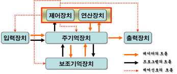

# 컴퓨터의 구성
컴퓨터가 가지는 구성에 대해 알아보자
 
컴퓨터 시스템은 크게 하드웨어와 소프트웨어로 나누어진다.
* **하드웨어** : 컴퓨터를 구성하는 기계적 장치이다.
* **소프트웨어** : 하드웨어의 동작을 지시하고 제어하는 명령어 집합

 

## 하드웨어 예시
* 중앙처리장치(CPU)
* 기억장치 : RAM, HDD
* 입출력 장치 : 마우스, 프린터

 

## 소프트웨어 예시
* 시스템 소프트웨어 : 운영체제, 컴파일러
* 응용 소프트웨어 : 워드프로세서, 스프레드시트

 

## 하드웨어
먼저 하드웨어에 대해 살펴보자.

하드웨어는 중앙처리장치(CPU), 기억장치, 입출력장치로 구성되어 있다.

이들은 시스템 버스로 연결되어 있으며, 시스템 버스는 데이터와 명령 제어 신호를 각 장치로 실어나르는 역할을 한다.

 

### 중앙처리장치(CPU)
* 인간으로 따지면 두뇌에 해당하는 부분이다.
* 주기억장치에서 프로그램 명령어와 데이터를 읽어와 처리하고 명령어의 수행 순서를 제어한다.
* 중앙처리장치는 비교와 연산을 담당하는 **산술논리연산장치(ALU)** 와 명령어의 해석과 실행을 담당하는 **제어장치**, 속도가 빠른 데이터 기억 장소인 **레지스터**로 구성되어 있다.
* 개인용 컴퓨터와 같은 소형 컴퓨터에서는 CPU를 마이크로프로세서라도고 부른다.

 

### 기억장치
* 프로그램, 데이터, 연산의 중간 결과를 저장하는 장치이다.
* 주기억장치와 보조기억장치로 나누어지며, RAM, ROM은 주기억장치 해당한다. 실행중인 프로그램과 같은 프로그램에 필요한 데이터를 일시적으로 저장한다.
* 보조기억장치는 하드디스크 등을 말하며, 주기억장치에 비해 속도는 느리지만 많은 자료를 영구적으로 보관할 수 있는 장점이 있다.

 

### 입출력장치
* 입력과 출력 장치로 나누어진다.
* 입력 장치는 컴퓨터 내부로 자료를 입력하는 장치로 키보드, 마우스 등이 해당한다.
* 출력 장치는 컴퓨터에서 외부로 표현하는 장치로 프린터, 모니터, 스피커 등이 해당한다.

 

## 시스템 버스
* 하드웨어 구성 요소를 물리적으로 연결하는 선이다.
* 각 구성요소가 다른 구성요소로 데이터를 보낼 수 있도록 통로가 되어준다.
* 용도에 따라 데이터 버스, 주소 버스, 제어 버스로 나누어진다.

 

### 데이터 버스
* 중앙처리장치와 기타 장치 사이에서 데이터를 전달하는 통로에 해당한다.
* 기억장치와 입출력장치의 명령어와 데이터를 중앙처리장치로 보내거나, 중앙처리장치의 연산 결과를 기억장치와 입출력장치로 보내는 '양방향' 버스이다.

 

### 주소 버스
* 데이터를 정확히 실어나르기 위해서는 기억장치 '주소'를 정해주어야 한다.
* 주소버스는 중앙처리장치가 주기억장치나 입출력장치로 기억장치 주소를 전달하는 통로이기 때문에 '단방향' 버스이다.

 

### 제어 버스
* 주소 버스와 데이터 버스는 모두 장치에 공유되기 때문에 이를 제어할 수단이 필요하다.
* 제어 버스는 중앙처리장치가 기억장치나 입출력장치에 제어 신호를 전달하는 통로이다.
* 제어 신호 종류 : 기억장치 읽기 및 쓰기, 버스 요청 및 승인, 인터럽트 요청 및 승인, 클락, 리셋 등이 있다.
* 제어 버스는 읽기 동작과 쓰기 동작을 모두 수행하기 때문에 '양방향' 버스이다.

 

컴퓨터는 기본적으로 **읽고 처리한 뒤 저장**하는 과정으로 이루어진다.
(READ -> PROCESS -> WRITE)

이 과정을 진행하면서 끊임없이 주기억장치(RAM)과 소통한다. 이때 운영체제가 64bit라면, CPU는 RAM으로부터 데이터를 한번에 64비트씩 읽어온다.

 

**[출처]**
* [원본링크](https://gyoogle.dev/blog/computer-science/computer-architecture/%EC%BB%B4%ED%93%A8%ED%84%B0%EC%9D%98%20%EA%B5%AC%EC%84%B1.html)