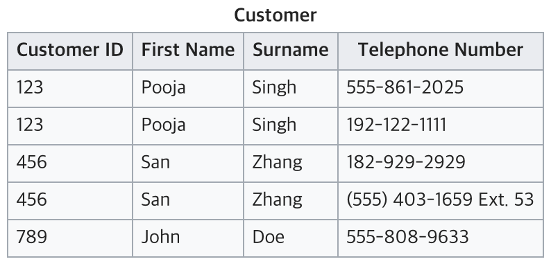

# 정규화에 대해서

## 정규화는 어떤 배경에서 생겨났는가?

한 릴레이션에 여러 엔티티의 속성을 혼합하면 정보가 **중복 저장** 되며 저장 공간을 낭비하게 된다. 또 중복된 정보로 인해 **이상 현상**이 발생하게 된다. 이러한 문제를 해결하기 위해 정규화 과정을 거치는 것이다.

### 이상 현상이란 무엇이며 어떠한 것들이 있는가?

**이상 현상** 이란, **테이블 내의 데이터들이 불필요하게 중복되어 테이블을 조작할 때 발생되는 데이터 불일치 현상** 이다. 테이블을 잘못 설계하여 삽입, 삭제, 갱신할 때 오류가 발생하게 되는 것이다. 이상현상에는 크게 3가지 이상현상이 있으며, 정규화를 통해서 이상 현상들을 해결할 수 있다.

* 삽입 이상(insertion anomalies): 원하지 않는 자료가 삽입된다든지, key가 없어 삽입하지 못하는(불필요한 데이터를 추가해야 삽입할 수 있음) 문제점

* 삭제 이상(deletion anomalies): 하나의 자료만 삭제하고 싶지만, 그 자료가 포함된 튜플 전체가 삭제됨으로 원하지 않는 정보 손실이 발생하는 문제점을 말한다.

* 수정(갱신) 이상(modification anomalies): 일부만 변경하여 데이터가 불일치하는 모순, 또는 중복되는
튜플이 존재하게 되는 문제점을 말한다.

 

## 그래서 정규화란 무엇인가?

관계형 데이터베이스에서 중복을 최소화하기 위해 데이터를 구조화하는 작업이다. 좀 더 구체적으로는 불만족스러운 **나쁜** 릴레이션의 속성들을 나누어서 **좋은** 작은 릴레이션으로 분해하는 작업을 말한다. 정규화 과정을 거치게되면 정규형을 만족하게 된다. 정규형란 특정 조건을 만족하는 릴레이션의 스키마의 형태를 말하며 제 1 정규형, 제 2 정규형, 제 3 정규형, ... 등이 존재한다.

즉, Attribute 간의 종속성으로 인한 이상현상이 발생하는 릴레이션을 분해하여 재디자인함으로써 이상 현상을 없애는 과정이며, 데이터의 중복 방지 및 무결성을 충족하기 위해 데이터베이스를 설계하는 방법이다.

 

### 정규화의 3 가지 원칙

1. **정보의 무손실** : 분해된 릴레이션이 표현하는 정보는 분해되기 전의 정보를 모두 포함해야 한다.

2. **최소 데이터 중복** : 이상 현상을 제거, 데이터 중복을 최소화

3. **분리의 원칙** : 하나의 독립된 관계성은 하나의 독립된 릴레이션으로 분리해서 표현

 

### `나쁜` 릴레이션은 어떻게 파악하는가?

엔티티를 구성하고 있는 속성 간에 함수적 종속성(Functional Depedency)을 판단한다. 판단된 함수적 종속성은 좋은 릴레이션 설계의 정형적 기준으로 사용된다. 즉, 각각의 정규형마다 어떠한 함수적 종속성을 만족하는지에 따라 정규형이 정의되고, 그 정규형을 만족하지 못하는 정규형을 나쁜 릴레이션으로 파악한다.

 

### 함수적 종속성이란 무엇인가?

함수 종속성(Functional Dependency)은 어떤 테이블의 속성 A와 B에 대하여, A값에 의해 B값이 유일하게 정해지는 관계를 말하며, "B는 A에 함수 종속이다"라고 한다. A→B의 기호로 나타낸다. 

이때, A를 결정자(Determinant)라고 하고, B를 종속자(Dependant)라고 한다. 

함수 종속성은 크게 완전 함수 종속과 부분 함수 종속, 이행적 함수 종속으로 나뉜다.

* 완전 함수 종속 : 기본키를 구성하는 모든 속성에 종속되는 경우

* 부분 함수 종속 : 기본키를 구성하는 속성의 일부에 종속되거나, 기본키가 아닌 다른 속성에 종속되는 경우

* 이행적 함수 종속 : A, B, C 세 속성이 있고 A→B, B→C 종속 관계가 있을 때, A→C가 성립하는 경우

위와 같은 테이블이 있다고 하자. 여러 학생들이 있고 각 학생별로 여러 과목을 수강한다고 할 때, 위 테이블의 기본키는 (학번, 과목번호)가 될 것이다. 

그렇다면, 이름과 학년은 학번만 알아도 유일하게 결정된다. 반면에 성적은 학번과 과목 번호를 모두 알아야 유일하게 결정된다. 따라서 그림으로 표현하면 다음과 같다.

그러므로, 학년과 이름은 (학번, 과목번호)에 대해 부분 함수 종속이고, 성적은 완전 함수 종속이다. 

이렇게 엔티티를 구성하는 속성간의 함수 종속성을 판단하여 좋은 릴레이션인지 알 수 있다.  

cf> 어트리뷰트들의 관계로부터 추론된 함수적 종속성들을 기반으로 추론 가능한 모든 함수적 종속성들의 집합을 폐포라고 한다.

 

### 정규형은 어떠한 조건을 만족해야 하는가?

1. 분해의 대상인 분해 집합 D는 **무손실 조인** 을 보장해야 한다.
2. 분해 집합 D는 함수적 종속성을 보존해야 한다.

 

## 제 1 정규형(1NF)
어트리뷰트의 도메인이 오직 `원자값`(더 이상 쪼개질 수 없는 단위)만을 포함하고, 튜플의 모든 어트리뷰트가 도메인에 속하는 하나의 값을 가져야 한다. 즉, 복합 어트리뷰트, 다중값 어트리뷰트, 중첩 릴레이션 등 비 원자적인 어트리뷰트들을 허용하지 않는 릴레이션 형태를 말한다.

현재 테이블은 전화번호를 여러개 가지고 있어 원자값이 아니다. 따라서 1NF에 맞추기 위해서는 아래와 같이 분리할 수 있다.

 

## 제 2 정규형

모든 비주요 어트리뷰트들이 주요 어트리뷰트에 대해서 **완전 함수적 종속이면** 제 2 정규형을 만족한다고 볼 수 있다. 완전 함수적 종속이란 `X -> Y`라고 가정했을 때, X의 어떠한 어트리뷰트라도 제거하면 더 이상 함수적 종속성이 성립하지 않는 경우를 말한다. 즉, **제 1 정규형이면서, 기본키에 속하지 않은 속성 모두가 기본키에 완전 함수 종속인 정규형** 을 말한다.

위 테이블에서 `Manufacturer`과 `Model`이 키가 되어 `Model Full Name`을 알 수 있다.

`Manufacturer Country`는 `Manufacturer`로 인해 결정된다(부분 함수 종속).

따라서, `Model`과 `Manufacturer Country`는 아무런 연관관계가 없는 상황이다.

결국 완전 함수적 종속을 충족시키지 못하고 있는 테이블이다. 부분 함수 종속을 해결하기 위해 테이블을 아래와 같이 나눠서 2NF를 만족할 수 있다.

 

## 제 3 정규형

어떠한 비주요 어트리뷰트도 기본키에 대해서 **이행적으로 종속되지 않으면** 제 3 정규형을 만족한다고 볼 수 있다. 이행 함수적 종속이란 `X -> Y`, `Y -> Z`의 경우에 의해서 추론될 수 있는 `X -> Z`의 종속관계를 말한다. 즉, 비주요 어트리뷰트가 비주요 어트리뷰트에 의해 종속되는 경우가 없는 릴레이션 형태를 말한다.

현재 테이블에서는 `Tournament`와 `Year`이 기본키다.

`Winner`는 이 두 복합키를 통해 결정된다.

하지만 `Winner Date of Birth`는 기본키가 아닌 `Winner`에 의해 결정되고 있다.

따라서 이는 3NF를 위반하고 있으므로 아래와 같이 분리해야 한다.

 

## BCNF(Boyce-Codd) 정규형

여러 후보 키가 존재하는 릴레이션에 해당하는 정규화 내용이다. 복잡한 식별자 관계에 의해 발생하는 문제를 해결하기 위해 제 3 정규형을 보완하는데 의미가 있다. 비주요 어트리뷰트(결정자)가 후보키(Alternative Key)로 취급되고 있지 않기에 **모든 결정자는 항상 후보키가 되도록 릴레이션을 분해해주는 과정을 말한다.**

아래와 같은 제 3 정규형을 만족하는 릴레이션이 있다고 가정하자. 한 교수당 하나의 수업만 맡는다고 가정한다.

이렇게 되면 제 3 정규형을 만족한다. 이 경우는 어떤 이상현상이 생길까?

* 삽입 이상 : 새로운 교수가 특정 과목을 담당한다는 새로운 정보를 추가할 수 없다. 적어도 한 명 이상의 수강 학생이 필요하다. 
* 삭제 이상 : 학번 100이 C234 과목을 취소하면, P2가 C234 과목을 담당한다는 정보도 삭제된다. 
* 갱신 이상 : P1의 과목이 변경되면 P1인 행을 모두 찾아 변경시켜주어야 한다.

이러한 이상현상이 생기는 이유는, **결정자(Determinant)가 후보키(Alternative Key)로 취급되고 있지 않기 때문이다.** 후보키는 슈퍼키(super key) 중에서 최소성을 갖는 키이므로 이 릴레이션에서는 (학번, 과목명)이나 (학번, 담당교수)가 후보키가 된다. 담당 교수만으로는 후보키가 될 수 없다. 하지만, 후보키가 아님에도 과목명을 결정할 수 있기 때문에 담당 교수는 결정자에 속한다. 

이 이상현상을 해결하기 위해서 **모든 결정자는 항상 후보키가 되도록 릴레이션을 분해해주면 강한 제3 정규형, 즉 BCNF를 만족하게 된다.**

각 정규형은 그의 선행 정규형보다 더 엄격한 조건을 갖는다.

* 모든 제 2 정규형 릴레이션은 제 1 정규형을 갖는다.
* 모든 제 3 정규형 릴레이션은 제 2 정규형을 갖는다.
* 모든 BCNF 정규형 릴레이션은 제 3 정규형을 갖는다.

수많은 정규형이 있지만 관계 데이터베이스 설계의 목표는 각 릴레이션이 3NF(or BCNF)를 갖게 하는 것이다.

 

## 정규화에는 어떠한 장점이 있는가?

1. 데이터베이스 변경 시 이상 현상(Anomaly) 제거 / 위에서 언급했던 각종 이상 현상들이 발생하는 문제점을 해결할 수 있다.

2. 데이터베이스 구조 확장 시 재 디자인 최소화 / 정규화된 데이터베이스 구조에서는 새로운 데이터 형의 추가로 인한 확장 시, 그 구조를 변경하지 않아도 되거나 일부만 변경해도 된다. 이는 데이터베이스와 연동된 응용 프로그램에 최소한의 영향만을 미치게 되며 응용프로그램의 생명을 연장시킨다.

3. 사용자에게 데이터 모델을 더욱 의미있게 제공 / 정규화된 테이블들과 정규화된 테이블들간의 관계들은 현실 세계에서의 개념들과 그들간의 관계들을 반영한다.

 

## 단점은 없는가?

릴레이션의 분해로 인해 릴레이션 간의 연산(JOIN 연산)이 많아진다. 이로 인해 질의에 대한 응답 시간이 느려질 수 있다. 조금 덧붙이자면, 정규화를 수행한다는 것은 데이터를 결정하는 결정자에 의해 함수적 종속을 가지고 있는 일반 속성을 의존자로 하여 입력/수정/삭제 이상을 제거하는 것이다. 데이터의 중복 속성을 제거하고 결정자에 의해 동일한 의미의 일반 속성이 하나의 테이블로 집약되므로 한 테이블의 데이터 용량이 최소화되는 효과가 있다. 따라서 정규화된 테이블은 데이터를 처리할 때 속도가 빨라질 수도 있고 느려질 수도 있는 특성이 있다.

 

## 단점에서 미루어보았을 때 어떠한 상황에서 정규화를 진행해야 하는가? 단점에 대한 대응책은?

조회를 하는 SQL 문장에서 조인이 많이 발생하여 이로 인한 성능저하가 나타나는 경우에 반정규화를 적용하는 전략이 필요하다.

 

### 반정규화(De-normalization, 비정규화)

`반정규화`는 정규화된 엔티티, 속성, 관계를 시스템의 성능 향상 및 개발과 운영의 단순화를 위해 중복 통합, 분리 등을 수행하는 데이터 모델링 기법 중 하나이다. 디스크 I/O 량이 많아서 조회 시 성능이 저하되거나, 테이블끼리의 경로가 너무 멀어 조인으로 인한 성능 저하가 예상되거나, 칼럼을 계산하여 조회할 때 성능이 저하될 것이 예상되는 경우 반정규화를 수행하게 된다. 일반적으로 조회에 대한 처리 성능이 중요하다고 판단될 때 부분적으로 반정규화를 고려하게 된다.

 

### 무엇이 반정규화의 대상이 되는가?

1. 자주 사용되는 테이블에 액세스하는 프로세스의 수가 가장 많고, 항상 일정한 범위만을 조회하는 경우
2. 테이블에 대량 데이터가 있고 대량의 범위를 자주 처리하는 경우, 성능 상 이슈가 있을 경우
3. 테이블에 지나치게 조인을 많이 사용하게 되어 데이터를 조회하는 것이 기술적으로 어려울 경우

 

### 반정규화 과정에서 주의할 점은?

반정규화를 과도하게 적용하다 보면 데이터의 무결성이 깨질 수 있다. 또한 입력, 수정, 삭제의 질의문에 대한 응답 시간이 늦어질 수 있다.

 

**참조**
* [원본링크1](https://gyoogle.dev/blog/computer-science/data-base/Normalization.html)
* [원본링크2](https://github.com/JaeYeopHan/Interview_Question_for_Beginner/tree/master/Database#%EC%A0%95%EA%B7%9C%ED%99%94%EC%97%90-%EB%8C%80%ED%95%B4%EC%84%9C)
* [원본링크3](https://rebro.kr/160?category=484170)