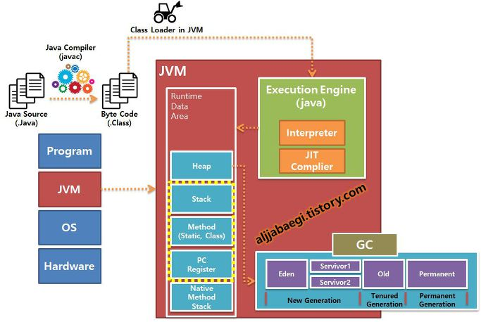

# 들어가기전

자바는 OS에 독립적인 특징을 가지고 있다. 그게 가능한 이유는 JVM(Java Vitual Machine) 덕분이다. 그렇다면 JVM(Java Vitual Machine)의 어떠한 기능 때문에, OS에 독립적으로 실행시킬 수 있는지 자바 컴파일 과정을 통해 알아보도록 하자.

 

## 자바 컴파일 순서

1. 개발자가 자바 소스코드(.java)를 작성합니다.

2. 자바 컴파일러(Java Compiler)가 자바 소스파일을 컴파일합니다. 이때 나오는 파일은 자바 바이트 코드(.class)파일로 아직 컴퓨터가 읽을 수 없는 자바 가상 머신이 이해할 수 있는 코드입니다. 바이트 코드의 각 명령어는 1바이트 크기의 Opcode와 추가 피연산자로 이루어져 있습니다.

3. 컴파일된 바이트 코드를 JVM의 클래스로더(Class Loader)에게 전달합니다.

4. 클래스 로더는 동적로딩(Dynamic Loading)을 통해 필요한 클래스들을 로딩 및 링크하여 런타임 데이터 영역(Runtime Data area), 즉 JVM의 메모리에 올립니다.
   * **클래스 로더 세부 동작**

    1. 로드 : 클래스 파일을 가져와서 JVM의 메모리에 로드합니다.

    2. 검증 : 자바 언어 명세(Java Language Specification) 및 JVM 명세에 명시된 대로 구성되어 있는지 검사합니다.

    3. 준비 : 클래스가 필요로 하는 메모리를 할당합니다. (필드, 메서드, 인터페이스 등등)

    4. 분석 : 클래스의 상수 풀 내 모든 심볼릭 레퍼런스를 다이렉트 레퍼런스로 변경합니다.

    5. 초기화 : 클래스 변수들을 적절한 값으로 초기화합니다. (static 필드)

5. 실행엔진(Execution Engine)은 JVM 메모리에 올라온 바이트 코드들을 명령어 단위로 하나씩 가져와서 실행합니다. 이때, 실행 엔진은 두가지 방식으로 변경합니다.
    1. 인터프리터 : 바이트 코드 명령어를 하나씩 읽어서 해석하고 실행합니다. 하나하나의 실행은 빠르나, 전체적인 실행 속도가 느리다는 단점을 가집니다.
    2. JIT 컴파일러(Just-In-Time Compiler) : 인터프리터의 단점을 보완하기 위해 도입된 방식으로 바이트 코드 전체를 컴파일하여 바이너리 코드로 변경하고 이후에는 해당 메서드를 더이상 인터프리팅 하지 않고, 바이너리 코드로 직접 실행하는 방식입니다. 하나씩 인터프리팅하여 실행하는 것이 아니라 바이트 코드 전체가 컴파일된 바이너리 코드를 실행하는 것이기 때문에 전체적인 실행속도는 인터프리팅 방식보다 빠릅니다.

 

## Kotlin 프로젝트 빌드 과정

코틀린도 jvm 위에서 동작하기 때문에 java 컴파일 과정과 유사합니다. 단, 코틀린 파일은 kotlin compiler를 통해 바이트 코드로 변환되는데, 이 코드는 kotlin runtime library에 의존되어 실행합니다.

kotlin runtime library에는 코틀린 자체 표준 라이브러리, JAVA API를 확장한 내용 등이 있습니다. 이는 Gradle, maven과 같은 빌드 도구가 Application으로 패키징할 때 알아서 kotlin runtime library를 포함시키게 됩니다.

 

## 코틀린 컴파일 과정

Java 코드와 Kotlin 코드가 함께 있는 프로젝트의 빌드 과정

1. Kotlin 컴파일러가 Kotlin 코드를 컴파일해 .class 파일을 생성한다.
이 과정에서 Kotlin 코드가 참조하는 Java 코드가 함께 로딩되어 사용된다.

2. Java 컴파일러가 Java 코드를 컴파일해 .class 파일을 생성한다. 이때 이미 Kotlin이 컴파일한 .class 파일의 경로를 클래스 패스에 추가해 컴파일한다.

 

**참조**
* [원본링크](https://gyoogle.dev/blog/computer-language/Java/%EC%BB%B4%ED%8C%8C%EC%9D%BC%20%EA%B3%BC%EC%A0%95.html)
* [링크1](https://steady-snail.tistory.com/67)
* [링크2](https://aljjabaegi.tistory.com/387)